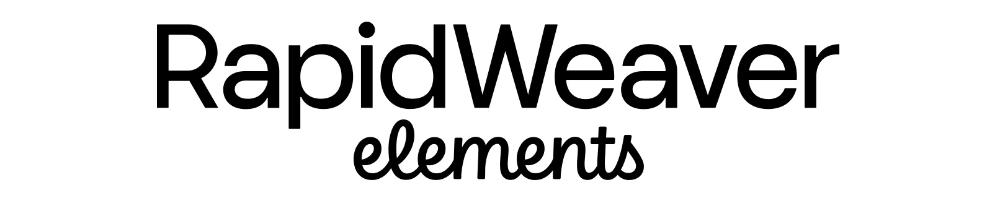

# Logotype

Use the RapidWeaver Elements logo on your website to let customers know your products are compatible with the next generation of RapidWeaver. The logotype and icon mark are available in both PNG and SVG formats.

### RapidWeaver Elements Logotype

<figure><figcaption>
RapidWeaver Elements Logotype - preview
</figcaption></figure>


RapidWeaver Elements Logotype - Transparent PNG file



RapidWeaver Elements Logotype - SVG


### RapidWeaver Elements Icon Mark

<figure><figcaption>
RWe Icon Mark - preview
</figcaption></figure>


RapidWeaver Elements Icon Mark - transparent PNG file



RapidWeaver Elements Icon Mark - SVG

