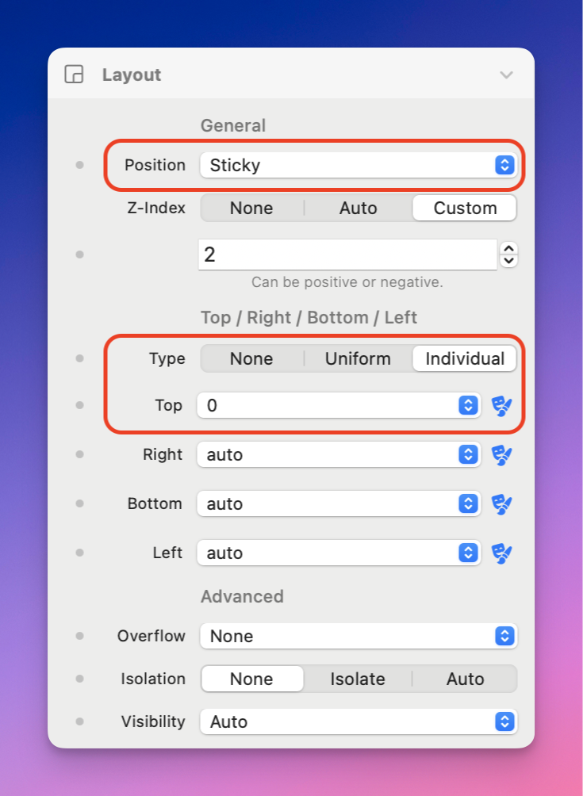

# Navigation - Standard

### How to create a traditional "Sticky" menu

The “Sticky” option under **Layout > Position** applies the CSS property `position: sticky`. However, it might not behave as intuitively as expected.

Simply setting Position to “Sticky” won’t automatically make your navbar stick to the top of the page. Here’s how to achieve that effect:

### **Option 1: Sticky Positioning**

1. Set **Position** to “Sticky”
2. Choose **Type** as “Individual”
3. Set **Top** to 0

<figure><figcaption></figcaption></figure>

### **Option 2: Fixed Positioning**

1. Set **Position** to “Fixed”
2. Choose **Type** as “Individual”
3. Set **Top** to 0

**Understanding the Difference: Sticky vs. Fixed**

• **Sticky Positioning**: The element with position: sticky will stay in place only after it has been scrolled to a specific point (e.g., Top set to 0). It combines characteristics of relative and fixed positioning, meaning it will move along with the page until it reaches the set position, where it then “sticks.” However, it requires a defined space around it to work effectively, so if the element’s container is too small or constrained, sticky positioning may not work as expected.

• **Fixed Positioning**: The element with position: fixed is completely removed from the document flow and will stay at a set position on the screen, regardless of scrolling. It is always visible at the specified position (e.g., top of the page) and doesn’t depend on other elements or its container size. This option is often more predictable for elements like a navbar, as it maintains its position consistently.

In most cases, “Fixed” will likely give you the desired result for a navbar that remains at the top of the page. However, feel free to experiment with both options to see which best suits your layout.
