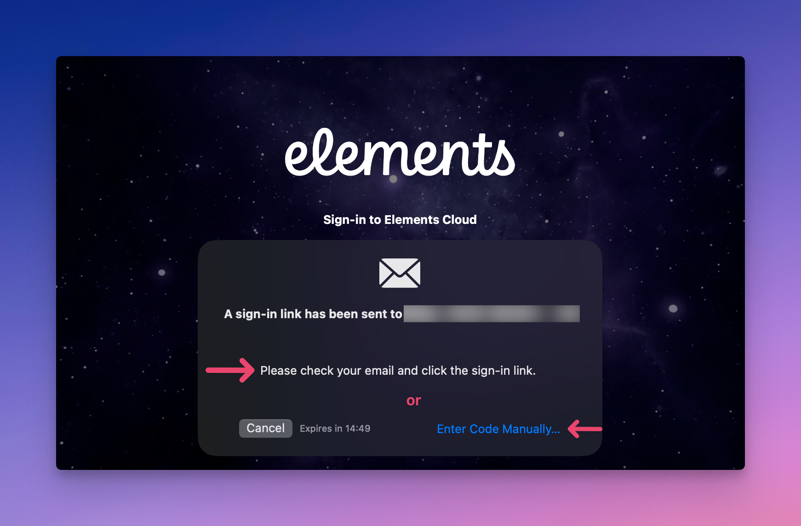
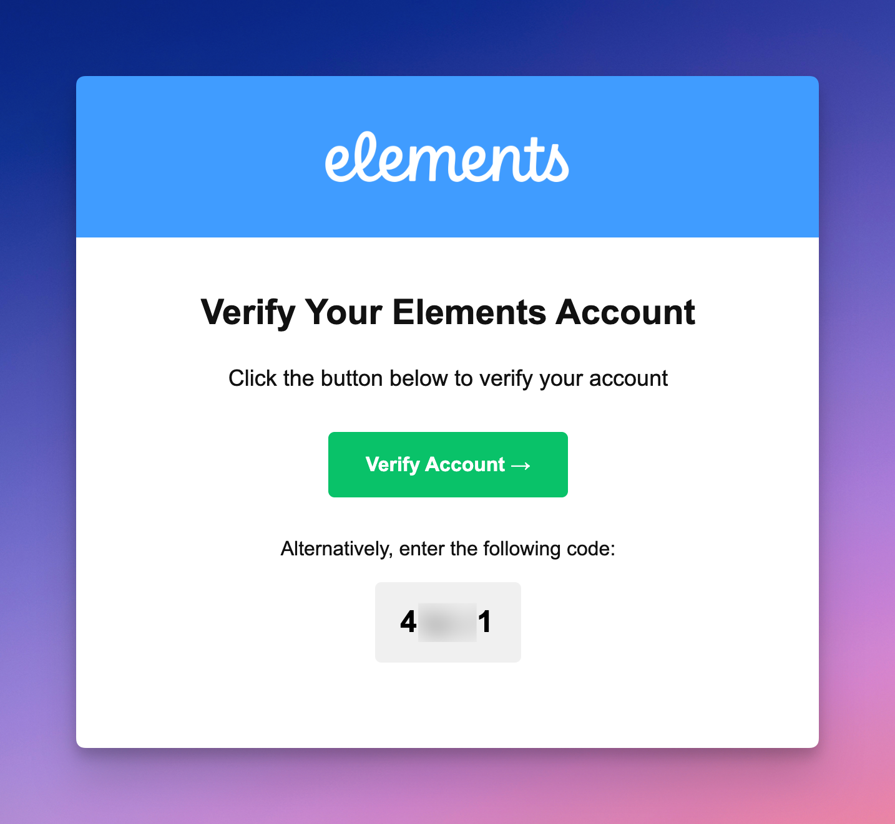
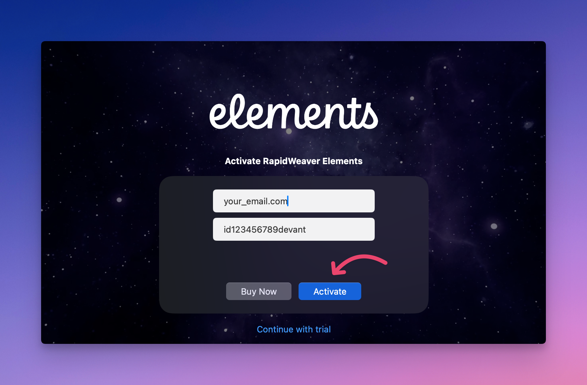
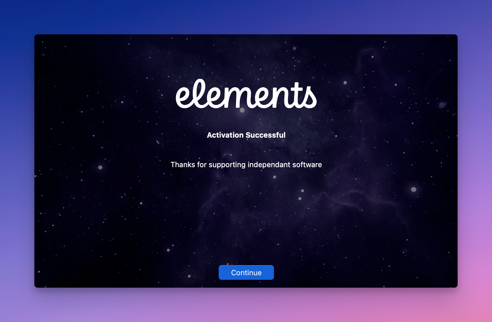

# FAQ

Welcome to the official FAQ for RapidWeaver Elements. This resource is designed to provide you with clear and concise answers to the most common questions.

Whether you’re just getting started or you’re an experienced user, our goal is to make sure you have all the information you need to build stunning websites with confidence.


If your question is not answered below, please [post our Community Support Forum](https://forums.realmacsoftware.com/). We'll get back to you within 48 hours. Don't worry, it's usually within a few hours or even quicker!


### General Questions

What are the system requirements for Elements?

In order to run Elements your Mac will need to meet the below requirements:

* macOS 13 (**Ventura**), macOS 14 (**Sonoma**), macOS 15 (**Sequoia**), or macOS 26 (**Tahoe**).
* Apple Silicon (M1, M2, M3, M4, M5) or Intel based processor.

Do you offer a trial version of Elements?

**Yes!** You can download a free trial of Elements from our [website](https://realmacsoftware.com/rapidweaver/).

What are the trial limitations?

The trial mode in Elements has the following limitations:

* No publishing: You can’t upload or publish sites in trial mode.
* No export: Exporting project files is disabled.
* Maximum of 3 pages: You can only add up to three pages per project.

Where can I purchase Elements?

You can [purchase Elements via our website](https://realmacsoftware.com/pricing/).&#x20;

I didn't receive a license email. Where is it?!

When you purchase Elements you will receive an order confirmation email within 5 minutes confirming your order along with your license number. The email will be sent from "[mailer@fastspring.com](mailto:mailer@fastspring.com)" which is our payment provider. If you can't find the email it's usually because of one of the following reasons:

* The email from us ended up in your Spam Folder.
* You entered your email address incorrectly when purchasing (no shame, we've all done it!).

The first step is to check your spam folder for anything from Realmac Software or [mailer@fastspring.com](mailto:mailer@fastspring.com).

If you still can't find your order email, you can contact us directly: [support@realmacsoftware.com](mailto:support@realmacsoftware.com). Please include your name, email address, and when you purchased Elements — this will help speed up the search!

I've lost my license, where can I find it?

If you've lost your license, visit our [License Manager](https://realmacsoftware.com/support/license-manager/) and use the automated system to help find your previous purchases.

If you’ve tried using our license manager and are still having issues, please email [support@realmacsoftware.com](mailto:support@realmacsoftware.com), and we’ll get you back up and running.

Be sure to check your Spam folder. Just in case!

I still have a question, where can I go for help?

If you question wasn't answered above or you need clarification, please [post on the Elements forum](https://forums.realmacsoftware.com/c/rapidweaver-elements/43), and we'll get back to you as soon as possible. Don't forget to [follow our Support Guide](getting-started/troubleshooting.md) to get your issue resolved even quicker.

### Pre-Sales Questions

What are the differences between the Base, Plus, and Pro licenses?

With Elements’ three license options: Base, Plus, and Pro, you can choose the plan that best fits your needs, whether you're a casual user, hobbyist, professional web designer, or multi-member team.

Every Elements license includes all you need to build the website you've always wanted, however, there are a few key differences. Please take a look at our [License Types document](getting-started/license-types.md) for more details.

Is Elements subscription based?

**No, not in the traditional sense.** When you [purchase a Elements license from our website](https://realmacsoftware.com/pricing/), you are automatically subscribed to one year of app updates. The license itself will not expire (**you can use it forever**), however the one year period of app updates will renew on an annual basis.

Please note the following:

* Subscriptions automatically renew **unless you cancel them**.
* If you cancel, your one year period of app updates will remain active until the next renewal date.
* You can [manage your subscription here](https://realmac.onfastspring.com/account/).

Do you offer refunds?

**Yes!** We offer a 30 day money-back guarantee.

If you've purchased Elements from us and are not happy, let us know within 30 days, and we'll issue a refund for you.

Please forward your original email receipt from your purchase to obtain your refund. While you don't have to do this, it does make it much quicker for us to find and process.

Send this email to [support@realmacsoftware.com](mailto:support@realmacsoftware.com)

We generally issue refunds within 48 hours (often quicker).


You don’t need to include a reason, but we really appreciate your feedback to help us improve Elements.


### Licensing Questions

How many Macs can I use my Elements license on?

Each Elements license allows activation on a maximum of three Macs simultaneously.

How do I activate my license?

When opening Elements for the first time, you will be greeted with a welcome screen. Click **Continue**.

Next you will need to create an Elements Cloud account. Enter your email address and click the "**Send Sign-in Link**" button.

<figure><figcaption></figcaption></figure>

You will receive a sign-in link from **noreply@elementsapp.cloud** via email. If you don't see it in your Inbox, please check your Spam folder as sometimes it can land there. Click the green "**Verify Account**" button in that email, or you can enter the code manually.

<figure><figcaption></figcaption></figure>

<figure><figcaption></figcaption></figure>

Next, you will activate your Elements license. Your license key can be located in the email you received when you completed your Elements purchase.

Enter your email address (the one you used to make your purchase), and your Elements license key on this screen and click "**Activate**".

<figure><figcaption></figcaption></figure>

Elements should now be activated and you can start building out of this world websites!

<figure><figcaption></figcaption></figure>

How do I deactivate my license?

If you have access to the activated version of our Elements, do this:

1. Open your registered version of the App.
2. Go to the App menu → Registration…
3. Click "Deactivate" under the "Activations (1 of X)" button.
4. Confirm your decision.

That's it. You can now use the same license to register the app on another Mac.

If you don't have access to your old Mac, you can still manage your license activations in the "Register…" window. This includes seeing what machines are licensed and deactivating any machines you no longer require. `Elements > Registration…`

Help, my license won't activate!

If you see the following "Unable to Activate" message, it may mean your license was entered incorrectly, or Elements is having trouble validating it over the internet.

You can email [support@realmacsoftware.com](mailto:support@realmacsoftware.com) with your license, we can check if it's valid and working. If it is, and your license is still not activating on your Mac, you should try the following things:

1. Check you don't have iCloud Private Relay or a VPN running.
2. Check you've not installed anything that blocks or tracks network traffic (i.e. LittleSnitch.app).
3. Reboot your Mac.
4. Try activating your license on another Mac.
5. Try activating your license on another network (3G/4G from your Phone).
6. Try starting your Mac in Safe Mode. A [guide can be found here](https://www.macworld.com/article/671817/how-to-start-a-mac-in-safe-mode.html) on how to do this.

Trying out the above will help you narrow down the problem and determine if your Mac or network is causing the issue.

I'm seeing an "Activation failure (404)" Error when I try to register. What should I do?

First, make sure you are running the latest version of Elements.

The **first thing to check** is that **your license number is correct**. You'll often see this error if the code is slightly wrong or missing a digit.

If you've triple-checked and made sure you're license code is correct, try the following steps:

1. Launch Elements and choose "Registration…" from the "Elements" menu.
2. Deactivate your Mac using the "Activations (1 of 2)" button, and Elements should become Unregistered. (if required)
3. Restart your Mac.
4. Launch Elements.
5. Open the Registration window again and press the "Activate License…" button and enter your new license details.
6. You should now be up and running.

If you're still having issues, you can email [support@realmacsoftware.com](mailto:support@realmacsoftware.com), and we'll be able to help you out.

Why am I seeing an "Update Period Expired" message when trying to register Elements?

You'll see this message if you're trying to activate a newer version of Elements that was released after your subscription period ended.

If your subscription has expired and you're trying to use a new version of Elements that was released after your subscription period you'll see the "Update Period Expired" window. You now have a couple of options. You can choose to purchase a new subscription to get access to the new version or get an older version of Elements that was covered during your active subscription period.

Elements will show you what version you can still use underneath the "Renew License" button. Clicking the button will take you to the release notes page where you can download this version.

### Subscription Questions

Can I switch to a different plan?

Yes, you can upgrade or downgrade at any time in app. Go to the Settings/Preferences window in Elements and look under the Subscription tab.

<figure><figcaption></figcaption></figure>

How do I manage my subscription?

Our [Billing Manager](https://realmac.onfastspring.com/account/) can help you check a subscription status, change payment details, and cancel your subscription. All you need is access to the email address you used to purchase our software.

If you no longer have access to the email address, contact [support@realmacsoftware.com](mailto:support@realmacsoftware.com), and we'll be able to help you directly.

What is your subscription cancellation policy?

You can cancel your subscription anytime via your [Billing Manager](https://realmac.onfastspring.com/account/).

We offer a 30 day money-back guarantee from the date you **initially purchase** a license for our software. During those initial 30 days you can cancel your subscription and request a refund with no questions asked.


Subsequent annual subscription renewals **are not refundable under our 30 day money-back guarantee.**


What happens if I cancel my subscription?

Your one year period of app updates will remain active. You will continue to receive updates until the next renewal date. If you wish to receive further updates after that renewal date, you will need to manually re-subscribe.

How do I cancel my subscription?

Hopefully this day will never come, but if you need to cancel your subscription for one of our apps, visit the [Billing Manager](https://realmac.onfastspring.com/account/) page.

What happens if my subscription expires?

You get to keep the version of Elements you're currently using, you just won't receive any further updates to it. You'll need to re-subscribe to start receiving updates again.

### Billing Questions

Where can I view my order history?

You can view your order history in our [Billing Manager](https://realmac.onfastspring.com/account/).

On the Billing Manager login page, enter the email address you used when purchasing Elements and then click the Continue button. You will receive a login link via email. If you don't see that email in your Inbox, please check your Spam folder as sometimes it can land there.

In that email, click on the link "**Click here to manage your orders.**"

Once logged in, navigate to the **Orders** tab to view your order history. Here you can view all your previous orders, as well as your license key(s). You can also view your order invoices, as well as download the most recent versions of our apps.


If you no longer have access to the email address you used when making your purchase, or you can't remember it, please [contact our support team](mailto:support@realmacsoftware.com) so we can help you regain access to the Billing Manager.


How can I update my payment and address information?

You can update your payment method and/or address information by logging into our [Billing Manager](https://realmac.onfastspring.com/account/).

On the Billing Manager login page, enter the email address you used when purchasing Elements and then click the Continue button. You will receive a login link via email. If you don't see that email in your Inbox, please check your Spam folder as sometimes it can land there.

In that email, click on the link "**Click here to manage your orders.**"

Once logged in, navigate to the **Account Details and Payment Methods** tab. Here you can add/remove payment methods, and edit your name and address information.


It is not possible to update your email address information via the Billing Manager. If you need to update your email address, please [contact our support team](mailto:support@realmacsoftware.com) so we can help you with that.


How can I update my email address?

It's not currently possible to update your email address via our [Billing Manager](https://realmac.onfastspring.com/account/).

If you need to update your email address, please email us at [support@realmacsoftware.com](mailto:support@realmacsoftware.com) and we can get that changed for you.

