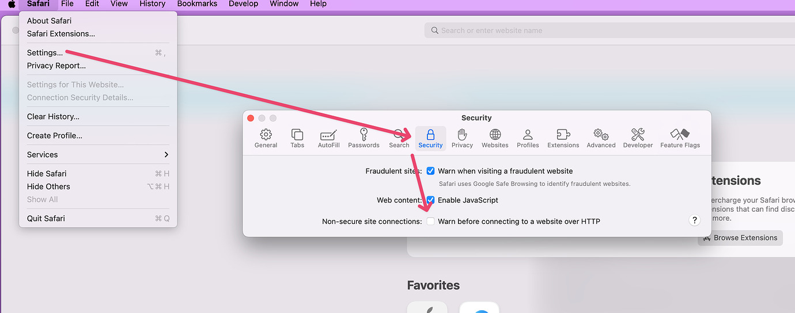

# FAQ

Welcome to the official FAQ for RapidWeaver Elements. This resource is designed to provide you with clear and concise answers to the most common questions.

Whether you’re just getting started or you’re an experienced user, our goal is to make sure you have all the information you need to build stunning websites with confidence.


If your question is not answered below, please [post on our Community Support Forum](https://forums.realmacsoftware.com/). We aim to reply within 48 hours, although it is often much sooner.


### General Questions

What are the system requirements for Elements?

To run Elements, your Mac must meet the following requirements:

* macOS 13.7.8 (**Ventura**), macOS 14 (**Sonoma**), macOS 15 (**Sequoia**), or macOS 26 (**Tahoe**).
* Apple silicon (M1, M2, M3, M4 or M5) or an Intel-based processor.

Do you offer a trial version of Elements?

**Yes!** You can download a free trial of Elements from our [website](https://realmacsoftware.com/rapidweaver/).

What are the trial limitations?

The trial mode in Elements has the following limitations:

* No publishing: You can’t upload or publish sites in trial mode.
* No export: Exporting project files is disabled.
* Maximum of 3 pages: You can only add up to three pages per project.

Where can I purchase Elements?

You can [purchase Elements via our website](https://realmacsoftware.com/pricing/).

I didn't receive a license email. Where is it?!

When you purchase Elements, you should receive an order confirmation email containing your license number within five minutes. The email is sent by our payment provider from [mailer@fastspring.com](mailto:mailer@fastspring.com). If you cannot find it, one of the following may have happened:

* The email went to your spam folder.
* You entered your email address incorrectly during the purchase.

First, check your spam folder for messages from Realmac Software or [mailer@fastspring.com](mailto:mailer@fastspring.com).

If you still cannot find the email, contact [support@elementsplatform.com](mailto:support@elementsplatform.com). Include your name, email address and approximate purchase date to help us find the order.

I've lost my license, where can I find it?

If you've lost your license, visit our [License Manager](https://realmacsoftware.com/support/license-manager/) and use the automated system to help find your previous purchases.

If you’ve tried using our license manager and are still having issues, please email [support@elementsplatform.com](mailto:support@elementsplatform.com), and we’ll get you back up and running.

Be sure to check your spam folder too.

I still have a question, where can I go for help?

If your question was not answered above or you need clarification, [post on the Elements forum](https://forums.realmacsoftware.com/c/rapidweaver-elements/43). Following our [Support Guide](getting-started/troubleshooting/) will help the community resolve your issue more quickly.

### Editor Issues

Error when trying to preview in Safari

If you are seeing a "Safari Can't Open the Page" error, you'll need to disable the "Warn before connecting to a Website over HTTP" option in the Safari Security settings.

<figure><figcaption></figcaption></figure>

How can I make a file (PDF, ZIP, audio, etc.) available for download on my website?

You can do this easily by adding a link to some text, a button, or whichever element you want. When setting the link, select the file from your resources and add a custom attribute called `download`. This attribute will prompt the browser to download the file, not open it.

<figure><figcaption></figcaption></figure>

### Pre-Sales Questions

What are the differences between the Base, Plus, and Pro licenses?

Elements offers three license options: Base, Plus and Pro. Choose the plan that best fits your needs, whether you are a casual user, hobbyist, professional web designer or part of a team.

Every Elements license includes everything you need to build a website, but there are a few key differences. See [License Types](getting-started/license-types.md) for details.

Is Elements subscription based?

**Elements uses a yearly subscription for app updates.** When you [purchase an Elements license from our website](https://realmacsoftware.com/pricing/), you receive the Mac app and one year of updates. The license itself does not expire, so you can continue using the latest version covered by your update period even if you cancel.

Please note the following:

* Subscriptions automatically renew **unless you cancel them**.
* If you cancel, your one year period of app updates will remain active until the next renewal date.
* You can [manage your subscription here](https://realmac.onfastspring.com/account/).

Do you offer refunds?

**Yes!** We offer a 30-day money-back guarantee.

If you've purchased Elements from us and are not happy, let us know within 30 days, and we'll issue a refund for you.

Forwarding your original email receipt will help us find and process the purchase more quickly, although it is not required.

Send this email to [support@elementsplatform.com](mailto:support@elementsplatform.com).

We generally issue refunds within 48 hours (often quicker).


You don’t need to include a reason, but we really appreciate your feedback to help us improve Elements.


### Licensing Questions

How many Macs can I use my Elements license on?

Each Elements license allows activation on a maximum of three Macs simultaneously.

How do I activate my license?

When you open Elements for the first time, a welcome screen appears. Click **Continue**.

Next, create an Elements Cloud account. Enter your email address and click **Send Sign-in Link**.

<figure><figcaption></figcaption></figure>

You will receive a sign-in link from **noreply@elementsapp.cloud**. If it is not in your inbox, check your spam folder. Click **Verify Account** in the email, or enter the code manually.

<figure><figcaption></figcaption></figure>

<figure><figcaption></figcaption></figure>

Next, activate your Elements license. The license key is in the email you received after completing your purchase.

Enter the email address used for the purchase and your Elements license key, then click **Activate**.

<figure><figcaption></figcaption></figure>

Elements is now activated and ready to use.

<figure><figcaption></figcaption></figure>

How do I deactivate my license?

If you have access to the activated copy of Elements:

1. Open your registered copy of Elements.
2. Choose **Elements → Registration…**
3. Click **Deactivate** under **Activations (1 of X)**.
4. Confirm your decision.

You can now use the same license to register the app on another Mac.

If you do not have access to your old Mac, you can still manage activations in the **Registration** window. Choose **Elements → Registration…** to view and deactivate registered Macs.

Help, my license won't activate!

If you see the following "Unable to Activate" message, it may mean your license was entered incorrectly, or Elements is having trouble validating it over the internet.

Email your license details to [support@elementsplatform.com](mailto:support@elementsplatform.com) and we can check whether they are valid. If the license is valid but still will not activate, try the following:

1. Check you don't have iCloud Private Relay or a VPN running.
2. Check that you have not installed anything that blocks or tracks network traffic, such as Little Snitch.
3. Reboot your Mac.
4. Try activating your license on another Mac.
5. Try activating your license on another network, such as a mobile hotspot.
6. Try starting your Mac in Safe Mode. Follow this [guide to starting a Mac in Safe Mode](https://www.macworld.com/article/671817/how-to-start-a-mac-in-safe-mode.html).

Trying out the above will help you narrow down the problem and determine if your Mac or network is causing the issue.

I'm seeing an "Activation failure (404)" error when I try to register. What should I do?

First, make sure you are running the latest version of Elements.

The **first thing to check** is that **your license number is correct**. You'll often see this error if the code is slightly wrong or missing a digit.

If you have confirmed that your license code is correct, try the following steps:

1. Launch Elements and choose "Registration…" from the "Elements" menu.
2. If required, deactivate your Mac using **Activations (1 of 2)**. Elements should become unregistered.
3. Restart your Mac.
4. Launch Elements.
5. Open the Registration window again, click **Activate License…** and enter your license details.
6. You should now be up and running.

If you're still having issues, you can email [support@elementsplatform.com](mailto:support@elementsplatform.com), and we'll be able to help you out.

Why am I seeing an "Update Period Expired" message when trying to register Elements?

You'll see this message if you're trying to activate a newer version of Elements that was released after your subscription period ended.

If your subscription has expired and you try to use a version released after your update period, the **Update Period Expired** window appears. You can renew to use the newer version or download an older version covered by your previous update period.

Elements shows the latest version you can use beneath **Renew License**. Click the version to open the release notes and download it.

### Subscription Questions

Can I switch to a different plan?

Yes. You can upgrade or downgrade at any time from the **Subscription** tab in Elements Settings.

<figure><figcaption></figcaption></figure>

How do I manage my subscription?

Our [Billing Manager](https://realmac.onfastspring.com/account/) lets you check your subscription status, change payment details and cancel your subscription. You need access to the email address used for the purchase.

If you no longer have access to the email address, contact [support@elementsplatform.com](mailto:support@elementsplatform.com), and we'll be able to help you directly.

What is your subscription cancellation policy?

You can cancel your subscription at any time through the [Billing Manager](https://realmac.onfastspring.com/account/).

We offer a 30-day money-back guarantee from the date you **initially purchase** a license for our software. During those initial 30 days, you can cancel your subscription and request a refund with no questions asked.


Subsequent annual subscription renewals **are not refundable under our 30-day money-back guarantee**, and cancelling does not refund unused time in the current update period.


What happens if I cancel my subscription?

Your one-year update period remains active until the next renewal date. To receive updates after that date, you will need to resubscribe.

How do I cancel my subscription?

Hopefully this day will never come, but if you need to cancel your subscription for one of our apps, visit the [Billing Manager](https://realmac.onfastspring.com/account/) page.

What happens if my subscription expires?

You can continue using the version of Elements covered by your update period, but you will not receive later updates. Resubscribe to begin receiving updates again.

### Billing Questions

Where can I view my order history?

You can view your order history in our [Billing Manager](https://realmac.onfastspring.com/account/).

On the Billing Manager sign-in page, enter the email address used to purchase Elements and click **Continue**. If the sign-in email does not appear in your inbox, check your spam folder.

In that email, click on the link "**Click here to manage your orders.**"

Once signed in, open the **Orders** tab to view previous orders, license keys and invoices, or download the latest versions of our apps.


If you no longer have access to the email address you used when making your purchase, or you can't remember it, please [contact our support team](mailto:support@elementsplatform.com) so we can help you regain access to the Billing Manager.


How can I update my payment and address information?

You can update your payment method and/or address information by logging into our [Billing Manager](https://realmac.onfastspring.com/account/).

On the Billing Manager sign-in page, enter the email address used to purchase Elements and click **Continue**. If the sign-in email does not appear in your inbox, check your spam folder.

In that email, click on the link "**Click here to manage your orders.**"

Once signed in, open **Account Details and Payment Methods**. Here you can add or remove payment methods and edit your name or address.


It is not possible to update your email address information via the Billing Manager. If you need to update your email address, please [contact our support team](mailto:support@elementsplatform.com) so we can help you with that.


How can I update my email address?

It's not currently possible to update your email address via our [Billing Manager](https://realmac.onfastspring.com/account/).

If you need to update your email address, please email us at [support@elementsplatform.com](mailto:support@elementsplatform.com) and we can get that changed for you.

