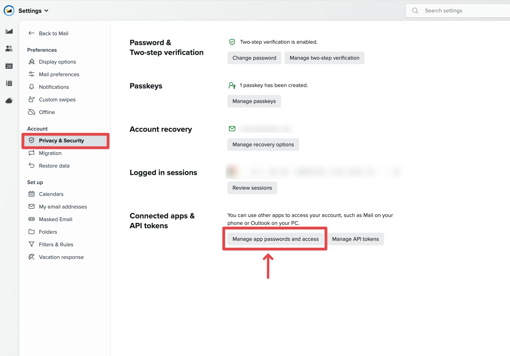
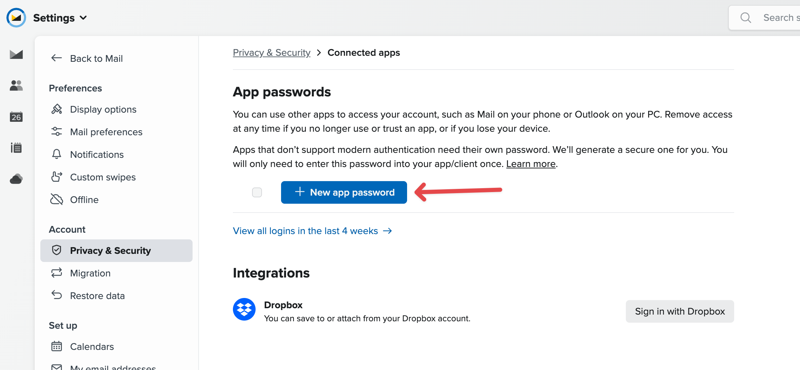
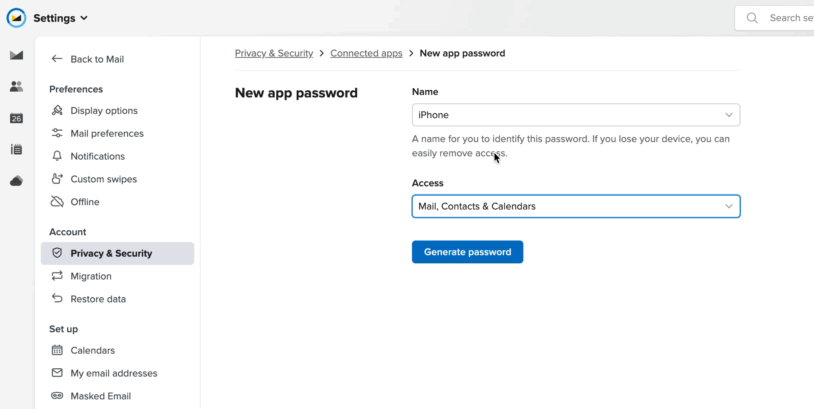
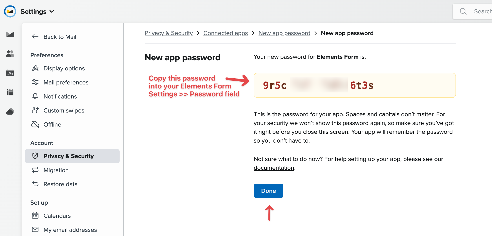
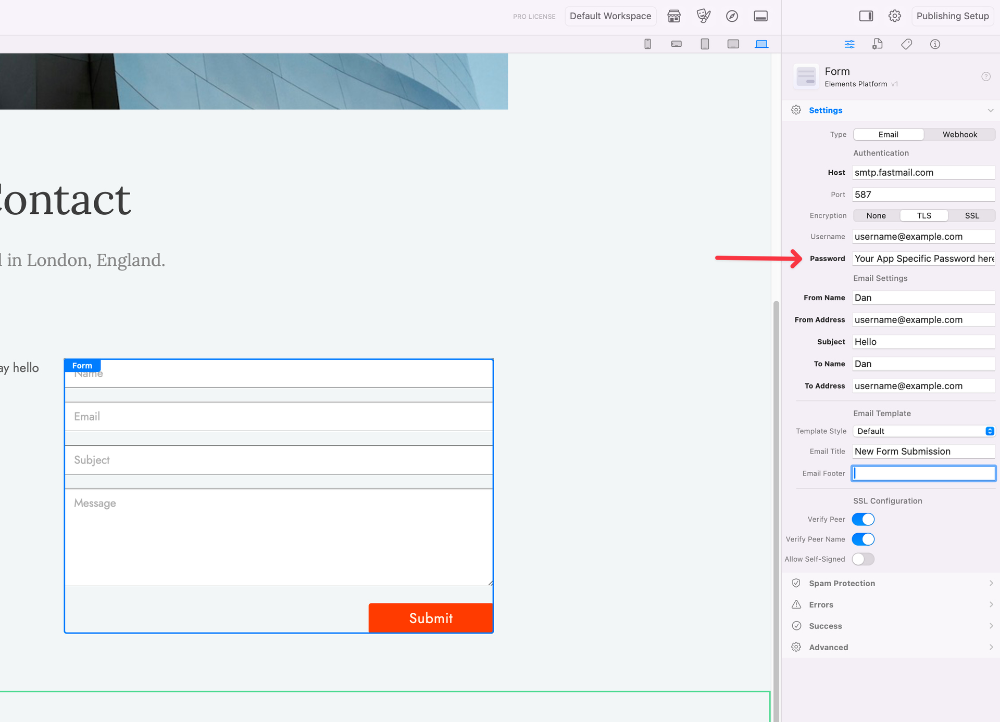

# Using Fastmail

Fastmail requires an [app-specific password](https://www.fastmail.help/hc/en-us/articles/360058752854) when the Form component connects to its SMTP service. Do not enter the password used to sign in to Fastmail.


[Sign up for a Fastmail account](https://app.fastmail.com/signup/).



Fastmail Basic plans do not include SMTP access and cannot create app passwords. Use a plan that supports third-party email clients.


### Create an App Password

1. Open **Fastmail Settings → Privacy & Security**.

<figure><figcaption>
Open the password and security settings.
</figcaption></figure>

2. Under **Connected apps & API tokens**, choose **Manage app passwords and access**, then **New app password**.

<figure><figcaption>
Create a separate credential for the Elements form.
</figcaption></figure>

3. Choose **Custom**, enter a recognisable name, give it Mail or SMTP access, and generate the password.

<figure><figcaption>
Limit the app password to SMTP access.
</figcaption></figure>

4. Copy the generated password. Fastmail may show it only once.

<figure><figcaption>
Store the generated password securely.
</figcaption></figure>

### Configure Form

In Form → Settings:

1. Keep Type set to Email.
2. Set Host to `smtp.fastmail.com`, Port to `465`, and Encryption to SSL. Alternatively, use Port `587` with TLS.
3. Enter the complete Fastmail email address as Username.
4. Paste the app-specific password into Password.
5. Use an address authorised by that Fastmail account as From Address.
6. Enter the recipient under To Address.

<figure><figcaption>
Use the app password rather than the normal account password.
</figcaption></figure>

Publish the site to a PHP-enabled server and complete a real submission. Forms cannot send from the normal local preview.

### Troubleshooting

If authentication fails:

* Confirm that the app password was created for SMTP.
* Remove accidental spaces before or after Username and Password.
* Confirm the Host, Port, and Encryption values against Fastmail’s current [server settings](https://www.fastmail.help/hc/en-us/articles/1500000278342-Server-names-and-ports).
* Make sure From Address is permitted by the authenticated account.
* Generate a new app password if the original was revoked or lost.

For additional help, post the error and relevant non-sensitive log details on the [Elements Forum](https://forums.realmacsoftware.com/). Never publish the app password.

### Related Documentation

* [Form](README.md) — Configures email delivery and server checks.
* [Submit](submit.md) — Adds the clickable control that sends the form.
