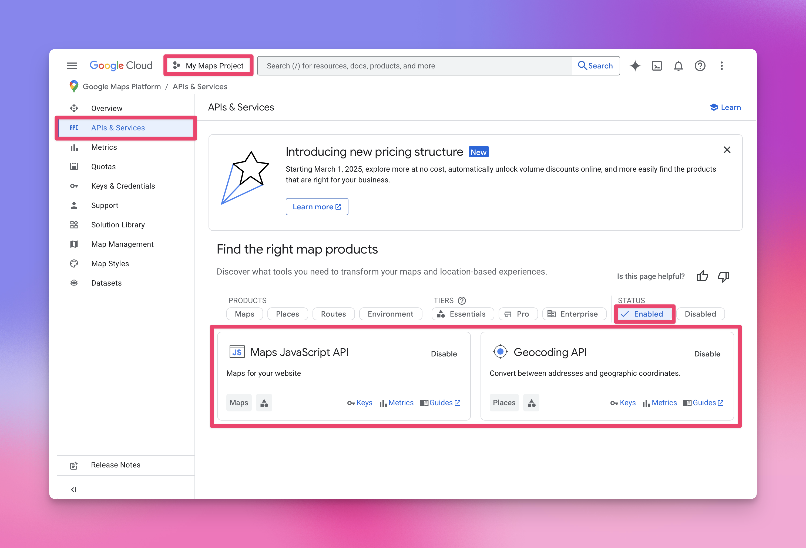
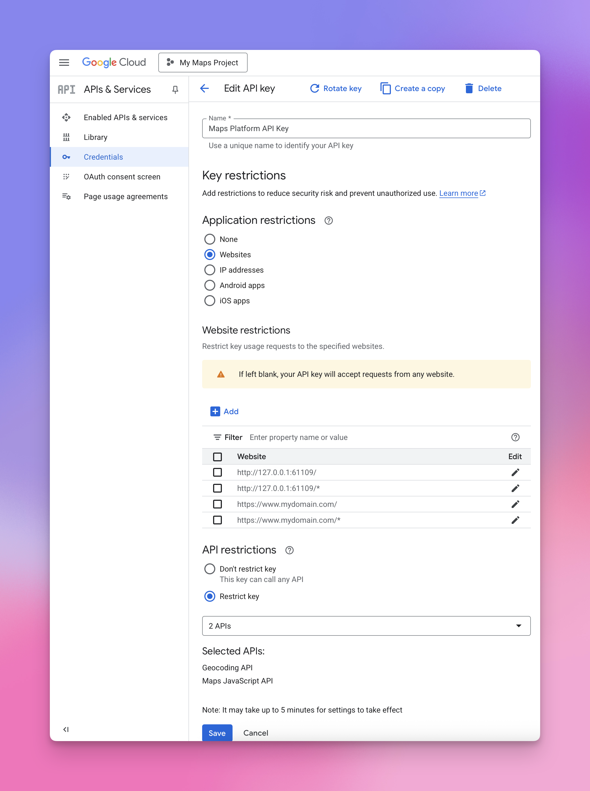

# Map (Free)


The Map component is available as a **free download via the Element Store**, it requires a free Google Maps API key to function.


### Google Maps API (Required)

To use the Maps component in Elements you need a [Maps API key from Google](https://developers.google.com/maps). It only takes a few minutes to set up. The quickest way to get setup is to watch the video and follow the instructions below.



#### 1. Create or sign in to your Google account

[Visit the Google Cloud Console](https://developers.google.com/maps) and sign in. If you have not used Google Cloud before, it will prompt you to create a new project.

#### 2. Create a new project

1. Open the project selector at the top of the page
2. Click New Project
3. Give it a name, then create it

#### 3. Enable the Maps JavaScript API & Geocoding API

1. With your new project selected, open the left sidebar
2. Go to APIs and Services
3. Click Enable APIs and Services
4. Search for Maps JavaScript API & Geocoding API
5. Open them and click Enable for both

<figure><figcaption>
This screenshot shows the expected appearance after enabling both the Maps JavaScript API and the Geocoding API.
</figcaption></figure>

#### 4. Generate your API key

1. In APIs and Services, go to Credentials
2. Click Create Credentials
3. Choose API key
4. Copy the key that appears

#### 5. Restrict your key

For security, set restrictions so the key can only be used from your website.

1. In the Credentials list, click your new key
2. Under Application Restrictions select Websites
3. Add the domains where your site will run
4. Save your changes

#### 6. Add the key to Elements

Open the Google Map component in Elements and paste the key into the API Key field. Once added, your map will load correctly during preview and when published.

### Testing locally on Your Mac

When working locally, you need to add referrers so your Google Maps API key works in both Elements preview and on your published site.

Add your live domain with two referrers:

`https://www.mydomain.com/`\
`https://www.mydomain.com/*`

To support local preview, first open the Elements Advanced settings and set a fixed preview port so it stays consistent.

<figure><figcaption></figcaption></figure>

Add that URL as another two referrers in the Google console. For example:

`http://127.0.0.1:61109`\
`http://127.0.0.1:61109/*`

Below are example settings for the API Key:

<figure><figcaption>
This screenshot shows the API Key's settings.
</figcaption></figure>
