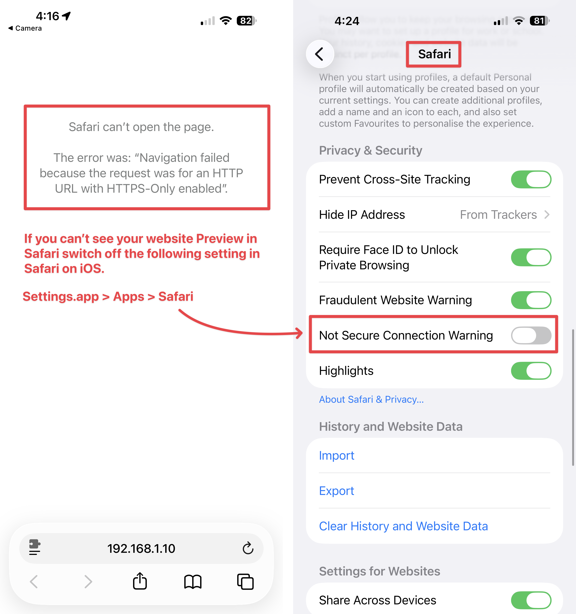

# Browser Preview

While the WYSIWYG editor allows you to view your design, you'll sometimes want to check how it looks in a browser.

To preview your website in your default browser, you can click the Safari Browser icon in the toolbar (Command-P). You can also press Command-Option-P to choose a different browser.



### Preview Troubleshooting&#x20;

For the local network web preview to be available you need to have already Previewed your site locally in the Browser. You can also press the "Restart Web Server" button to start the local preview and generate a new QR Code to scan.

<figure><figcaption>
Press "Restart Web Server" to start Local Preview
</figcaption></figure>

Once the web server is running you have two ways of getting the address for your local network preview. Copy and Paste the URL from the Advanced Project Settings, Or point your iPhone at the QR Code.

<figure><figcaption>
Scan QR Code to open URL on iPhone or iPad, etc.
</figcaption></figure>

#### Safari can't open the page

If you cannot see the Preview in Safari, you might be blocking http traffic. Either try another browser, or switch off the "Not Secure Connection Warning" in the Safari Settings.

This setting can be found in `Settings.app > Apps > Safari`.

<figure><figcaption></figcaption></figure>

**Still having local network preview issues?**

* [Follow the advice on this Forum thread](https://forums.realmacsoftware.com/t/need-help-with-network-preview-in-elements-2-0-beta-6/54453).
