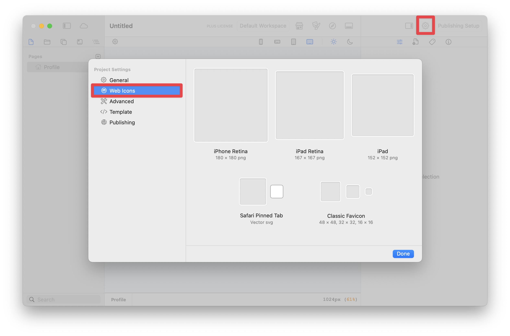

# Web Icons

Elements makes adding favicons and web icons straightforward. Simply drop a PNG or JPG image into the iPhone Retina, iPad Retina, or iPad drop zone and Elements will automatically generate a favicon.ico file in the root of your website. There’s no need to create this file manually or worry about image sizes.

Once your icons are added, Elements automatically generates all the required header code for your site. This ensures each icon is correctly referenced and displayed across supported browsers and platforms, without any additional setup.

Here's an example of the code Elements will add to the header of your website:


```html
  <link rel="icon" href="/favicon.ico" sizes="48x48 32x32 16x16" /> 
  <link rel="apple-touch-icon" type="image/png" href="resources/apple-touch-icon-180x180.png" sizes="180x180" /> 
  <link rel="apple-touch-icon" type="image/png" href="resources/apple-touch-icon-167x167.png" sizes="167x167" /> 
  <link rel="apple-touch-icon" type="image/png" href="resources/apple-touch-icon-152x152.png" sizes="152x152" /> 
  <link rel="mask-icon" href="resources/safari-pinned-tab.svg" color="rgba(0,162,255,1.00)" /> 
```


This approach keeps your project tidy while making sure your website looks polished when bookmarked, pinned, or added to a home screen.

#### Supported favicon formats

Elements currently supports the following favicon and web icon types:

*   **iPhone Retina (JPG or PNG)**

    Used when a site is saved to the Home Screen on iPhones with Retina displays.
*   **iPad Retina (JPG or PNG)**

    Optimised for iPads with Retina displays.
*   **iPad (JPG or PNG)**

    Used on older or non-Retina iPad models.
*   **Safari Pinned Tab (SVG)**

    An SVG icon used for pinned tabs in Safari, with support for a custom colour.
*   **Classic Favicon (JPG or PNG)**

    Automatically generated in 48×48, 32×32, and 16×16 sizes for broad browser compatibility, exported as favicon.ico to the root of the website.

### Adding Favicons

Favicons are managed from your project settings. To get started, click the gear icon in the toolbar to open Project Settings, then select Web Icons from the sidebar.&#x20;

You’ll see a set of clearly labelled drop wells for each supported icon type, including iPhone, iPad, Safari pinned tabs, and the classic favicon.

<figure><figcaption><p>Web Icons in Project Settings Window</p></figcaption></figure>

#### Adding icon files

There are two easy ways to add icons to your project:

* Drag and drop PNG, JPG, or SVG files directly from the Finder into the appropriate drop well.
* Click a drop well to open a menu showing image resources already included in your project.

Once an image is added, Elements automatically processes it, generates any required sizes, and updates your site’s header code. There’s no need to manually edit files or add markup yourself.

#### Making changes

You can replace or update icons at any time by dropping in a new image. Elements will regenerate the necessary assets the next time your site is published, keeping everything in sync.

This setup ensures your site displays the correct icon across browsers, devices, and platforms with minimal effort.

### Further Reading

The topic of favicons has proven to be more exhaustive than anyone could have ever wished. The following article shows how to support just the essentials (and keep yourself sane) while doing it.

* [How to Favicon in 2025: Three files that fit most needs](https://evilmartians.com/chronicles/how-to-favicon-in-2021-six-files-that-fit-most-needs).


