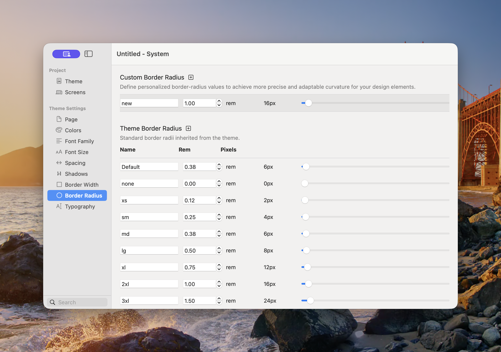

# Border Radius

Border Radius controls the reusable corner shapes available to Components. A consistent radius scale helps cards, buttons, images, fields, and panels feel like part of the same design system.

<figure><figcaption>
The selected theme supplies a radius scale that can be customised for the project.
</figcaption></figure>

### Theme Border Radii

The standard scale contains:

* **Default** — The theme’s recommended general-purpose corner radius.
* **none** — Square corners.
* **xs**, **sm**, **md**, **lg**, **xl**, **2xl**, and **3xl** — Progressively rounder corners.
* **full** — A very large radius used for pills and circular shapes.

The exact **Default** value can vary by theme. This lets one theme feel sharp and architectural while another feels softer and more rounded.

### Add or Adjust a Radius

1. Open **Theme Studio → Border Radius**.
2. To add a project-specific value, select the plus button beside Custom Border Radius.
3. Enter a **Name** and set the value in rem.
4. To change the inherited scale for the project, adjust the appropriate Theme Border Radius row.
5. Review buttons, cards, fields, images, and other Components using that value.

Theme Studio also displays the pixel equivalent. Use the field for precise entry and the slider for visual adjustment.


Start with **Default**. Add a custom radius only when it represents a repeatable part of the project’s visual language.


### Choosing a Radius

* Use **none** for intentionally square layouts.
* Use smaller values for compact controls and subtle rounding.
* Use medium values for cards and panels.
* Use larger values for prominent artwork or soft interface styles.
* Use **full** for pills, circular avatars, and controls that must remain fully rounded at different sizes.

Avoid mixing many unrelated radius values on the same page. Repetition is what makes the scale feel intentional.

See [Common Controls → Borders](../components/common-controls/borders.md) for applying a theme radius to Components.
