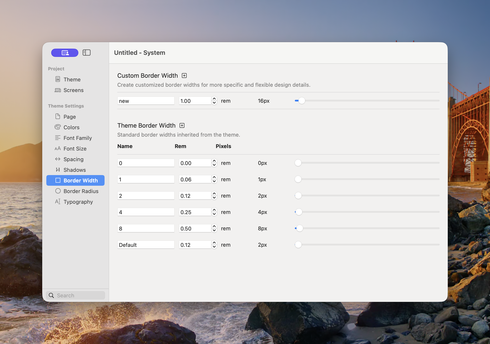

# Border Width

Border Width defines the thickness values available to Component border controls. The shared scale keeps outlines, dividers, cards, and controls visually consistent.

<figure><figcaption>
Theme values can be reviewed and adjusted alongside project-specific custom widths.
</figcaption></figure>

### Theme Border Widths

The standard theme scale contains:

| Name | Typical value |
|---|---:|
| `0` | 0px |
| `1` | 1px |
| `2` | 2px |
| `4` | 4px |
| `8` | 8px |
| **Default** | The theme’s recommended general-purpose width |

The exact **Default** value belongs to the selected theme. Use it when a component needs a border but does not require a deliberately heavier or lighter treatment.

### Add or Adjust a Width

1. Open **Theme Studio → Border Width**.
2. To add a project-specific value, select the plus button beside Custom Border Width.
3. Enter a **Name** and set the rem value.
4. To customise the inherited scale for the project, adjust the relevant Theme Border Width row.
5. Review Components that already use the changed value.

Theme Studio displays the pixel equivalent beside each rem value. At the standard root size, `0.0625rem` is 1px.


Changing an established theme value updates every Component that references it. Use a new custom width when the change should not be global.


### Best Practices

* Use **Default** for most cards, fields, and controls.
* Use `0` to remove a border without changing the selected border style.
* Reserve heavier values for deliberate emphasis.
* Check that borders remain visible against both light and dark backgrounds.
* Keep focus outlines distinct from decorative borders.

See [Common Controls → Borders](../components/common-controls/borders.md) for applying width, style, colour, and radius to Components.
