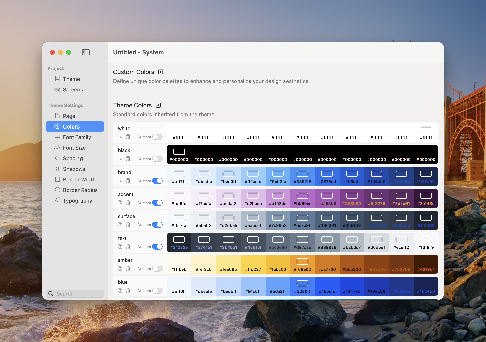

# Colors

Colors manages the reusable colour palettes available to components throughout the project. Each palette contains shades from 50 to 950, giving you coordinated light, mid, and dark values for backgrounds, text, borders, gradients, and interactive states.



<figure><figcaption>
Each colour palette provides a reusable range of shades.
</figcaption></figure>

### Custom and Theme Colours

* **Custom Colors** — Project-specific palettes you add with the plus button.
* **Theme Colors** — Palettes supplied by the selected theme.

Use the plus button beside either group to add a colour. The duplicate button creates a copy that can be used as a starting point, and the delete button removes a colour you no longer need.

Each row contains:

* **Name** — The label shown in component colour pickers.
* **Colour scale** — Eleven swatches numbered 50, 100, 200, 300, 400, 500, 600, 700, 800, 900, and 950.
* **Custom** — When off, Elements generates a coordinated shade scale from the chosen colour. Turn it on to edit individual swatches.


Renaming or deleting a colour that is already used can affect components that reference it. Check the project after changing an established palette.


### Recommended Theme Colours

When building your site, we recommend sticking to the core theme colours: **Brand**, **Accent**, **Surface**, and **Text**. These colours are designed to work together across all components and templates. By using them consistently, you gain a few key benefits:

* **Global control** — Update a palette once and every component using it updates.
* **Consistency** — Components and Templates are designed around the core semantic roles.
* **Flexibility** — Rebrand a project without replacing colours component by component.
* **Compatibility** — New Components and Templates can inherit familiar semantic colours.

For best results, avoid using custom colours. Instead, use **Brand**, **Accent**, **Surface**, and **Text** where possible. This way, your design remains easy to manage, flexible to update, and consistent across the entire project.

### Theme Colour Roles

*   **Brand**

    Use this as your primary identity colour. It’s often the colour from your logo or the one most associated with your brand. Common uses include buttons, navigation highlights, and key interactive elements.
*   **Accent**

    This is your secondary highlight colour. It’s best used sparingly to draw attention or provide contrast. Examples include links, badges, icons, or subtle hover states.
*   **Surface**

    The foundation of your design. Surface colours are used for backgrounds, cards, panels, and containers. They provide structure and help separate sections of your site. Surfaces often have light and dark variants for depth.
*   **Text**

    Reserved for all typography, from body copy to headings. Text colours should maintain strong contrast against your surface colours for readability. The Theme Studio manages light and dark variations automatically.

### Choosing Shades

Lower-numbered shades are generally lighter and higher-numbered shades are generally darker. The Text palette may intentionally reverse that visual progression so its named shades provide appropriate contrast in light and dark appearance.

Use neighbouring shades for subtle state changes and more distant shades for stronger contrast. For example, a button might use Brand 500 normally and a darker Brand shade on hover.

### Accessibility

* Check text and icon contrast against the exact background shade in both light and dark appearance.
* Do not use colour as the only way to communicate an error, selection, or status.
* Keep focus indicators visibly distinct from their surroundings.
* Test custom shade scales rather than assuming every generated pair has sufficient contrast.

### Recommended Workflow

1. Set Brand and Accent from the project’s visual identity.
2. Choose a neutral or tinted Surface scale.
3. Configure Text to remain readable across Surface shades.
4. Preview common Components in light and dark appearance.
5. Add custom palettes only when the four semantic roles cannot express the design.
