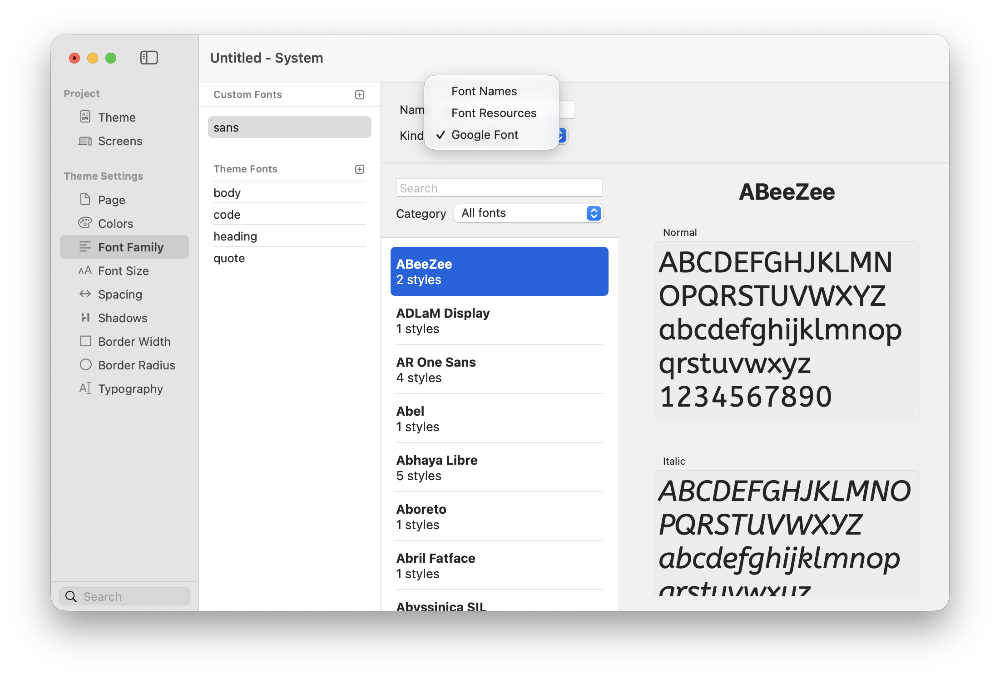

# Font Family

Font families define the overall personality of your site. Elements can use a CSS font-name stack, font files stored in project Resources, or a Google Font.

<figure><figcaption>
Custom fonts appear alongside the Body, Code, Heading, and Quote fonts inherited from the theme.
</figcaption></figure>

### Custom and Theme Fonts

* **Custom Fonts** — Font families added for the current project.
* **Theme Fonts** — The semantic font roles supplied by the theme: **body**, **code**, **heading**, and **quote**.

Use these semantic roles in Components and [Typography](typography.md) so a future font change updates the whole project.

### Font Kinds

When adding a custom font, enter a recognisable **Name** and choose its **Kind**:

* **Font Names** — Uses a CSS font-family list such as `Inter, Helvetica, Arial, sans-serif`. The visitor must have one of the named fonts available.
* **Font Resources** — Uses font files stored in the project Resources.
* **Google Font** — Opens a searchable catalogue with available styles and a live preview.

### Using System Fonts

System font stacks avoid downloading a separate font file and usually render immediately. Include several suitable fallbacks and finish the list with a generic family such as `sans-serif`, `serif`, or `monospace`.

Learn more about what fonts are supported by popular operating systems on the following sites:

* [https://systemfontstack.com](https://systemfontstack.com)
* [https://modernfontstacks.com](https://modernfontstacks.com)

### Using Custom Fonts

Elements includes a built-in Font Manager that lets you add local web fonts. It supports common formats such as `.woff`, `.woff2`, and `.ttf`.

Watch the video below to learn more about adding custom fonts to your website:



For modern browser support and smaller downloads, use WOFF2 where possible.

#### Recommended Formats

1. **WOFF2** — Preferred for modern websites.
2. **WOFF** — Useful when supporting older browsers.
3. **TTF** — Usually larger and best reserved for specific compatibility needs.



#### Add a Fonts Folder to Your Project

1. Open your project in Elements.
2. Go to Resources.
3. Create a new folder named "fonts" (lowercase is recommended).
4. Drag your downloaded font files into this folder.
   * A family may contain separate files for its weights and styles.

<figure><figcaption>
Keep project font files together in Resources.
</figcaption></figure>




#### Create a Custom Font in Theme Studio

1. Open Theme Studio.
2. In the Font Family section, add a New Custom Font.
3. Give it a name, like Mighty or Rubik.
4. Set Kind to Font Resource.
5. Drag your font files from Resources into the drop area.
   * For a single-face font, drag in the one file.
   * For multi-weight fonts, add each weight file.&#x20;

<figure><figcaption>
Set the custom font Kind to Font Resource.
</figcaption></figure>

<figure><figcaption>
Add each required font weight and style.
</figcaption></figure>




#### Assign Weights for Multi-Font Families

Elements usually detects weights correctly, but it depends on how the font is packaged.

1. Select each imported font file.
2. Check the assigned Weight in the Inspector.
3. Correct anything that isn’t right. This ensures Elements uses the proper weights when you switch between font styles.



#### Apply the Custom Font to Elements in Your Project

1. Select a text component.
2. Change its Font to your new custom font. The change appears immediately.&#x20;



### Using Google Fonts

1. Add a Custom Font.
2. Set **Kind** to Google Font.
3. Search by family name or browse a category.
4. Select the family and the styles needed by the project.
5. Apply the new font through Components or Typography.

Only include weights and styles you actually use. Each additional font file increases the amount visitors may need to download.

### Accessibility and Performance

* Choose body fonts that remain legible at smaller sizes.
* Avoid using a very light weight for long passages.
* Provide suitable fallback fonts.
* Confirm that bold and italic content has the corresponding font files or styles.
* Check the licence for every font you distribute with a website.

### Troubleshooting

If a custom font doesn’t appear correctly:

* Check the weight assignments in the Inspector.
* Make sure the fonts are placed in the fonts folder inside Resources.
* Confirm that the font is selected by the relevant Typography style or Component.
* Check filename case if the published server is case-sensitive.
* Re-add the font in Theme Studio if needed.

If you still have trouble, visit the [Elements Forum](https://forums.realmacsoftware.com/).
