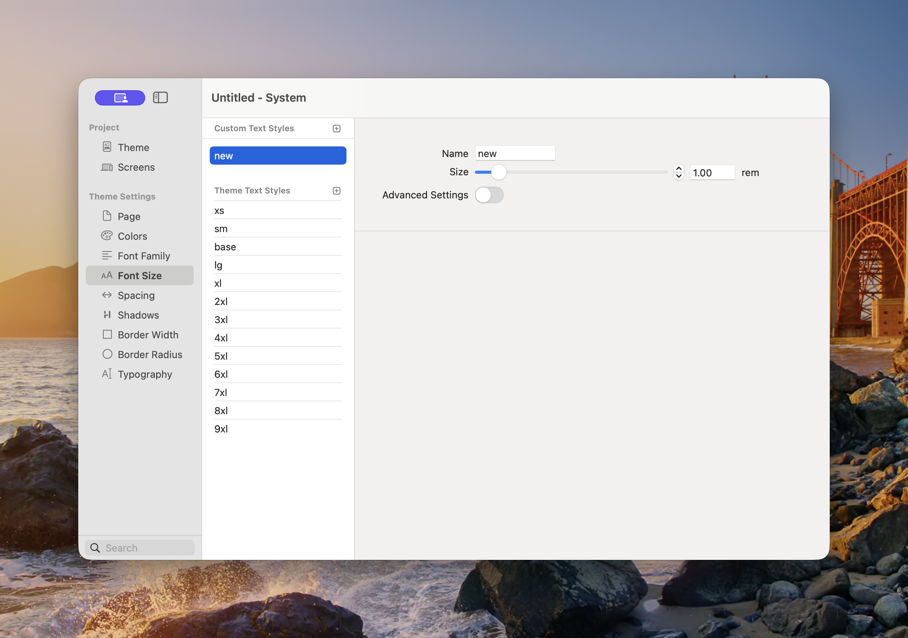

# Font Size

Font Size defines the reusable text sizes available throughout the project. Theme values provide a consistent scale from `xs` to `9xl`, and custom values let you add a size for a specific design system need.

<figure><figcaption>
Font sizes are stored in rem units so they scale consistently with the root text size.
</figcaption></figure>

### Custom and Theme Text Styles

* **Custom Text Styles** — Project-specific font sizes added with the plus button.
* **Theme Text Styles** — Sizes inherited from the selected theme: `xs`, `sm`, `base`, `lg`, `xl`, `2xl`, `3xl`, `4xl`, `5xl`, `6xl`, `7xl`, `8xl`, and `9xl`.

The `base` size is the normal starting point for body text. Larger names form a progressive display scale; smaller names are useful for captions and supporting text.

### Add a Font Size

1. Open **Theme Studio → Font Size**.
2. Select the plus button beside Custom Text Styles.
3. Enter a short, meaningful **Name**.
4. Set the **Size** in rem.
5. Enable **Advanced Settings** when the size needs its own line height.
6. Apply the new value in a Component or [Typography](typography.md) preset.

At the standard browser root size, `1rem` is normally `16px`. Rem values respect a visitor’s text-size preferences more reliably than fixed pixel values.

### Advanced Settings

Enable **Advanced Settings** to set the line height associated with the font size. Use enough line height to keep wrapped lines distinct:

* Body text generally needs more line height than a short heading.
* Very large display text can use a tighter line height.
* Test headings that wrap onto two or more lines.

### Responsive Text

Components that expose responsive Font Size controls can select a different Theme Studio size at each enabled [Screen](screens.md). Start with the Mobile size, then add larger overrides only where needed.

### Best Practices

* Reuse a small, deliberate type scale.
* Use `base` or a nearby size for comfortable body copy.
* Avoid custom sizes that differ by only a fraction with no clear purpose.
* Check large headings on narrow screens.
* Keep the relationship between Font Size and [Typography](typography.md) clear: Font Size defines individual scale values, while Typography combines them with font, weight, colour, spacing, and element styles.
