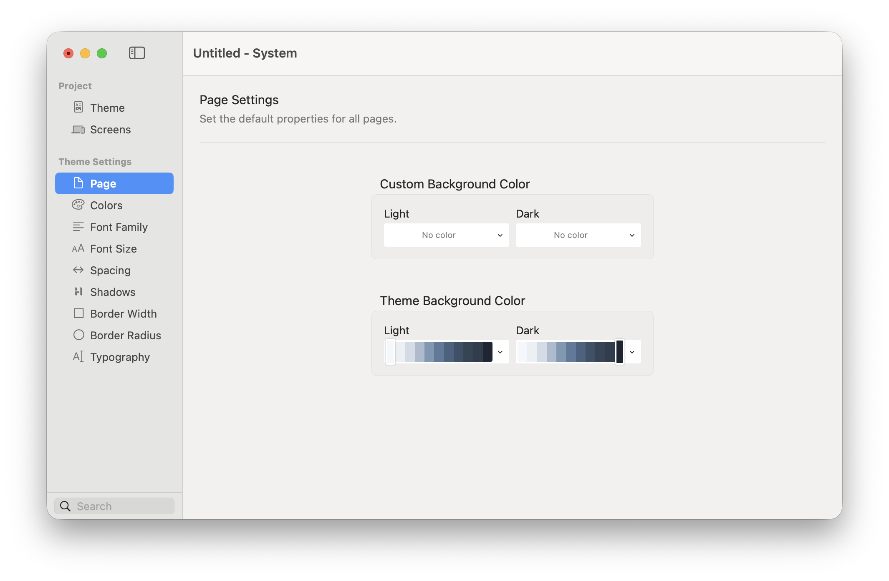

# Page

Page sets the default background colour for every page in the project. The selected theme supplies separate light and dark colours, and you can override either appearance for the current project.

<figure><figcaption>
Leave a Custom Background Color unset to use the corresponding Theme Background Color.
</figcaption></figure>

### Background Colour Settings

* **Custom Background Color — Light** — Overrides the theme background in light appearance.
* **Custom Background Color — Dark** — Overrides the theme background in dark appearance.
* **Theme Background Color — Light** — Shows the light page colour inherited from the selected theme.
* **Theme Background Color — Dark** — Shows the dark page colour inherited from the selected theme.

Choose **No color** for a custom value when you want the page to follow the selected theme again.

### How to Set the Page Background

1. Open **Theme Studio → Page**.
2. Leave the custom Light and Dark values unset to use the theme defaults.
3. To override the theme, choose a palette and shade for Light, Dark, or both.
4. Preview the project in both appearances.
5. Check text, links, borders, and form controls for sufficient contrast.


Use a [Surface colour](colors.md) for most page backgrounds. This keeps backgrounds coordinated with cards, panels, and text colours across the project.


Individual sections and components can still apply their own backgrounds. The Page value is the default visible wherever no component background covers it.
