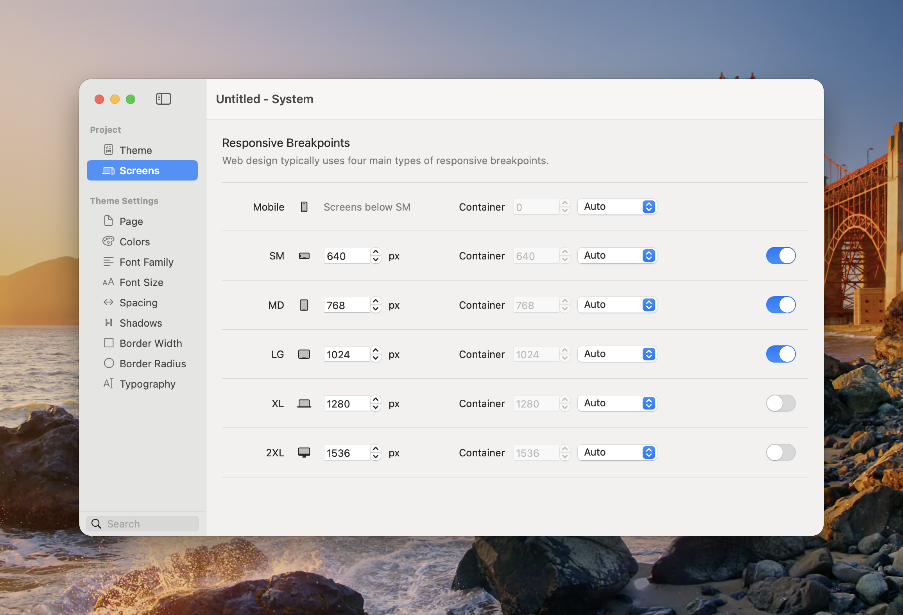

# Screens

Screens defines the responsive breakpoints and container widths used throughout the project. Components with responsive controls inherit these screen sizes.

<figure><figcaption>
Each screen can define a breakpoint, a container width, and whether that breakpoint is active.
</figcaption></figure>

### Default Breakpoints

| Screen | Starts at | Typical use |
|---|---:|---|
| **Mobile** | Below SM | Base design for phones and all smaller widths |
| **SM** | 640px | Large phones and small tablets |
| **MD** | 768px | Tablets |
| **LG** | 1024px | Laptops and smaller desktops |
| **XL** | 1280px | Wide desktop layouts |
| **2XL** | 1536px | Extra-wide desktop layouts |

Mobile is the base screen and does not need its own minimum width. Values set at Mobile apply everywhere until they are overridden at a larger enabled breakpoint.

### Configure a Screen

For each named screen:

* **Breakpoint** — Sets the viewport width at which the screen begins.
* **Container** — Sets the project-wide maximum container width at that screen. Auto keeps Mobile fluid and uses the screen width for the named breakpoints; choose a custom value when the layout needs a narrower content width.
* **Enabled** — Makes the breakpoint available to responsive component controls. Disable breakpoints you do not intend to design for.

Keep breakpoint values in ascending order. A larger screen should not begin before the screen listed above it.


Most projects do not need every breakpoint. A smaller set of deliberate breakpoints is often easier to maintain than separate overrides for every screen size.


### Mobile-First Behaviour

Elements uses a mobile-first cascade:

1. Design the Mobile appearance first.
2. Move to the next enabled screen.
3. Add an override only where the layout needs to change.
4. That override continues to larger screens until another breakpoint changes it.

See [Breakpoints](../responsive-breakpoints.md) for an explanation of the responsive override indicators used in the component Inspector.

### Container Widths

Container widths control components that use the project’s shared container sizing. They do not force every component to that width; a component must be configured to use the container value.


