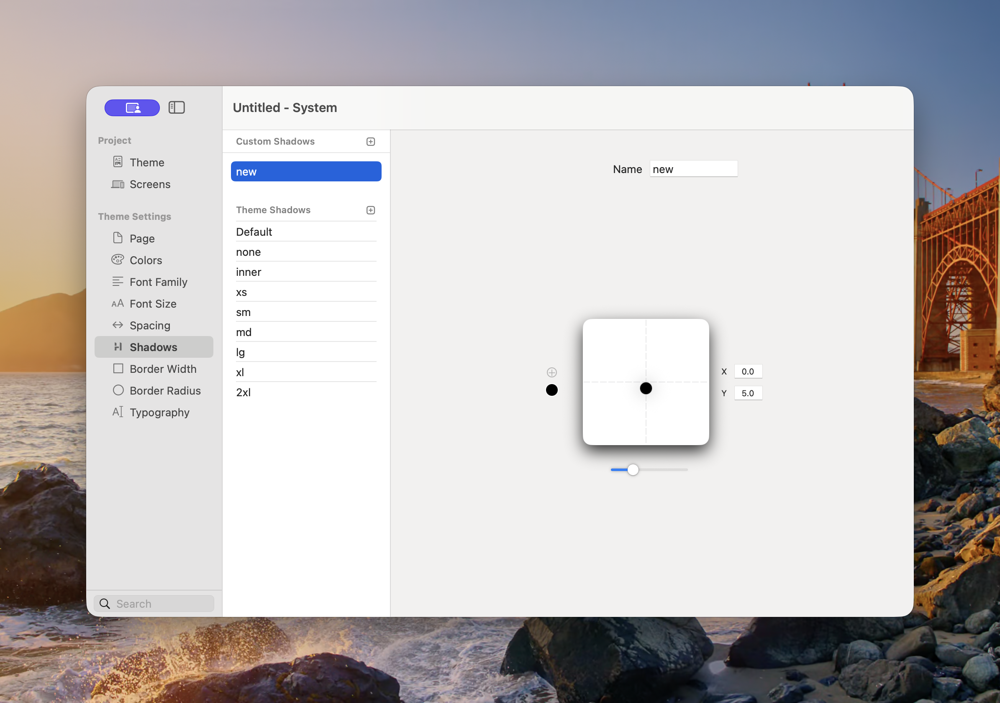

# Shadows

Shadows defines the reusable shadow treatments available to Components. Use them to separate cards from a background, raise interactive elements, create inset surfaces, or establish a consistent sense of depth.

<figure><figcaption>
The editor provides a live preview while you adjust the shadow.
</figcaption></figure>

### Custom and Theme Shadows

* **Custom Shadows** — Project-specific styles added with the plus button.
* **Theme Shadows** — Styles inherited from the selected theme.

The standard theme names are:

* **Default** — The theme’s recommended general-purpose shadow.
* **none** — Removes the shadow.
* **inner** — Draws the shadow inside the element.
* **xs**, **sm**, **md**, **lg**, **xl**, and **2xl** — Progressively stronger depth treatments.

The exact appearance can vary between themes. For example, one theme may use soft diffused shadows while another uses sharp, offset shadows.

### Create a Custom Shadow

1. Open **Theme Studio → Shadows**.
2. Select the plus button beside Custom Shadows.
3. Enter a descriptive **Name**.
4. Drag the point in the preview or enter **X** and **Y** offsets.
5. Adjust the blur or softness control.
6. Choose the shadow colour and opacity.
7. Add another shadow layer when the design requires a more natural combined effect.

The preview updates as you work. Apply the finished shadow through a Component’s Shadow or Effects controls.

### Choosing a Shadow

Start with **Default** for general cards and controls. Use smaller shadows for subtle separation and larger shadows for overlays or floating elements. Use **inner** only when the visual treatment should appear recessed.


Large, dark shadows can reduce clarity and make a layout feel inconsistent. Use a small number of repeated depth levels across the project.


### Accessibility and Design

* Do not rely on shadow alone to show keyboard focus.
* Make sure controls remain understandable when shadows are subtle or unavailable.
* Check shadows in both light and dark appearance.
* Use sufficient contrast between an element and its background before adding a shadow.

See [Common Controls → Effects](../components/common-controls/effects.md) for applying theme shadows to Components.
