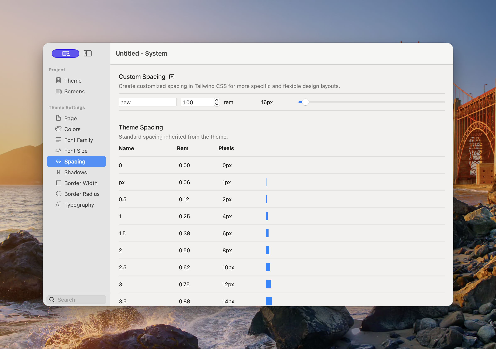

# Spacing

Spacing provides reusable values for gaps, padding, margins, positioning, and other layout controls. A shared scale creates consistent visual rhythm and makes site-wide adjustments easier.

<figure><figcaption>
The inherited scale shows each value in rem and its pixel equivalent.
</figcaption></figure>

### Theme Spacing

The selected theme supplies a spacing scale with familiar names such as `0`, `px`, `0.5`, `1`, `1.5`, `2`, and larger steps. Components refer to the name rather than storing a one-off measurement.

At the standard browser root size:

| Name | Rem | Pixels |
|---|---:|---:|
| `0` | 0 | 0px |
| `px` | 0.0625rem | 1px |
| `0.5` | 0.125rem | 2px |
| `1` | 0.25rem | 4px |
| `2` | 0.5rem | 8px |
| `3` | 0.75rem | 12px |
| `4` | 1rem | 16px |

The scale continues with larger values for section spacing and layout.

### Add Custom Spacing

1. Open **Theme Studio → Spacing**.
2. Select the plus button beside Custom Spacing.
3. Enter a meaningful **Name**.
4. Set the value in rem using the field, stepper, or slider.
5. Use the new value in compatible Component controls.

The pixel value shown in Theme Studio is a convenient equivalent. Elements stores the scale in rem so it remains relative to the project’s root text size.


Before adding a custom value, check whether a nearby theme value will work. A smaller scale is easier to use consistently.


### Best Practices

* Use neighbouring scale values for related distances.
* Reserve large values for major section separation.
* Use smaller values for gaps inside a component.
* Keep vertical rhythm consistent across repeated sections.
* Review spacing at every enabled [Screen](screens.md); a desktop-sized gap may be excessive on Mobile.

See [Common Controls → Spacing](../components/common-controls/spacing.md) for how the shared scale is applied as margin and padding.
