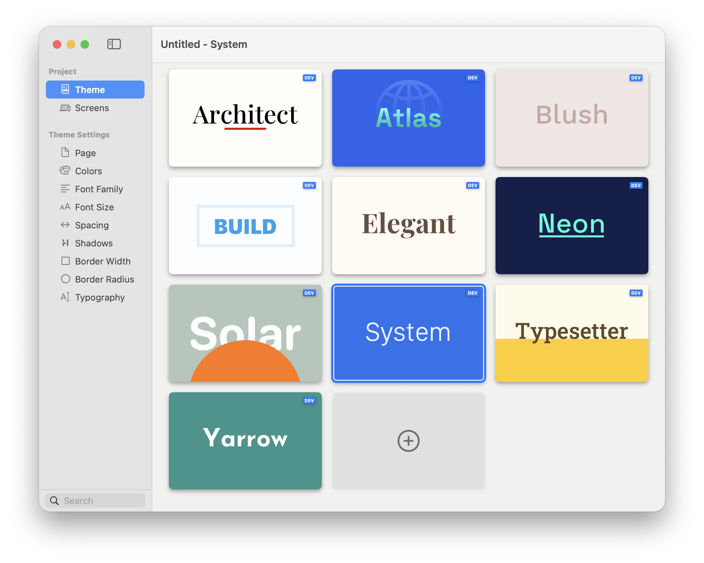

# Theme

Themes provide the starting design system for a project. A theme supplies coordinated colours, font families, font sizes, spacing, shadows, border values, typography, and page colours.

Open **Theme Studio → Theme** and select a theme card to apply it to the project.

<figure><figcaption>
Select a theme to change the project-wide design foundation.
</figcaption></figure>

### Choosing a Theme

1. Open **Theme Studio → Theme**.
2. Select a theme card.
3. Review representative pages at mobile and desktop sizes.
4. Check both light and dark appearance.
5. Refine the shared values in the remaining Theme Studio sections.

Components that use theme values update with the new design system. Direct custom values remain deliberate exceptions, so review them when switching to a visually different theme.


Choose a theme for its overall structure and character, then customise its Brand, Accent, Surface, Text, fonts, and defaults for the project.


### Creating a Custom Theme

You can create reusable themes using the built-in Elements DevTools. A custom theme can define its own colour system, typography scale, spacing, shadows, borders, and other shared values.


**Theme creation is only available on the Pro plan**. Base and Plus users can still override theme values, and customise styling on a per project basis.


Before creating a theme, create or open a Dev Pack to hold it. Then:

1. Open **Theme Studio → Theme**.
2. Select the plus card at the end of the theme list.
3. Choose the Dev Pack and enter the theme details.
4. Configure the theme values in Theme Studio.
5. Add an icon later if one was not supplied during creation.

<figure><figcaption>
Choose a Dev Pack and enter the custom theme details.
</figcaption></figure>

### Before Switching Themes

* Save a copy of the project if you want an easy comparison point.
* Check every page background and text contrast after switching.
* Review custom colours and component-level overrides.
* Confirm that typography and spacing still fit the content.

### Dev Diary Videos for Themes

The following video will show you how themes work in Elements. The video was recorded with a development version of Elements so the feature(s) available now may differ slightly to those in the video.


