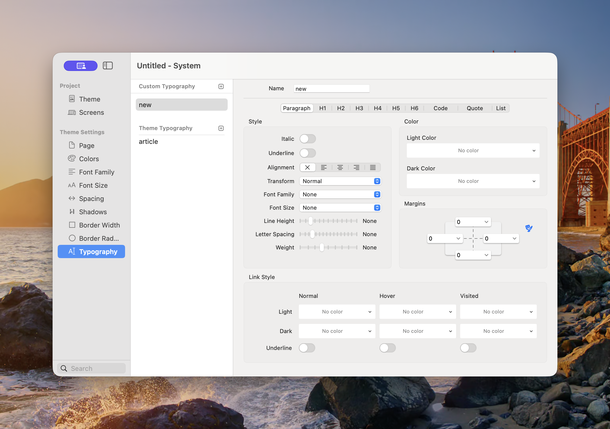

# Typography

Typography combines the project’s fonts, sizes, colours, alignment, spacing, and link treatments into reusable presets. A preset can style all the common text elements in long-form content as one coordinated system.

<figure><figcaption>
Each tab controls one type of content within the selected typography preset.
</figcaption></figure>

### Custom and Theme Typography

* **Custom Typography** — Presets created for the current project.
* **Theme Typography** — Presets inherited from the selected theme. The standard preset is named **article**.

Use a custom preset when the project needs more than one long-form treatment, such as separate styles for articles, legal pages, or compact documentation.

### Create a Typography Preset

1. Open **Theme Studio → Typography**.
2. Select the plus button beside Custom Typography.
3. Give the preset a descriptive **Name**.
4. Work through each content tab.
5. Apply the preset to a Component that provides a Typography control.
6. Test realistic content containing headings, paragraphs, lists, links, quotes, and code.

### Content Tabs

The preset provides separate settings for:

* **Paragraph**
* **H1**, **H2**, **H3**, **H4**, **H5**, and **H6**
* **Code**
* **Quote**
* **List**

These tabs style the corresponding content elements. They do not change the semantic heading level in the page content.

### Style

Depending on the selected content type, the Style group can include:

* **Italic** and **Underline**
* **Alignment** — Inherit, Left, Centre, Right, or Justify
* **Transform** — Controls text case
* **Font Family** — Uses a family from [Font Family](font-family.md)
* **Font Size** — Uses a value from [Font Size](font-style.md)
* **Line Height**
* **Letter Spacing**
* **Weight**

Choose inherited or unset values when a property should follow the surrounding component rather than forcing an override.

### Colour

Set separate Light and Dark text colours. Choose a semantic palette and shade from [Colors](colors.md), then verify contrast against the backgrounds where the typography will be used.

### Margins

Margins control the space around each content type. Set Top, Right, Bottom, and Left values from the [Spacing](spacing.md) scale. Link sides when they should change together, or unlink them for individual control.

Paragraph and heading margins are especially important in long-form content. Test consecutive headings, lists after paragraphs, nested content, and the final element in a text block.

### Link Style

Typography can define link treatment for three states:

* **Normal**
* **Hover**
* **Visited**

Each state supports separate Light and Dark colours and its own underline setting. Do not rely on colour alone: underlines provide a clear visual distinction between links and surrounding text.

### Accessibility

* Keep heading levels in a logical order in the content.
* Use comfortable body size and line height.
* Avoid justified alignment when it creates uneven spacing that is difficult to read.
* Make links identifiable without relying only on colour.
* Check every text and link state in light and dark appearance.
* Do not use text transformation as a substitute for writing content with the intended capitalisation.

### Dev Diary Videos for Typography

The following video introduces typography in Elements. It was recorded with a development version, so the current interface may differ slightly.


