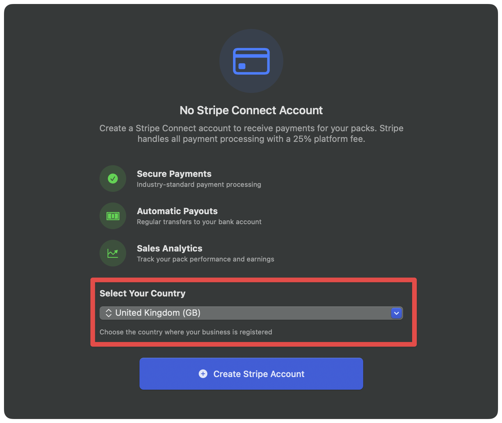

# Getting Started


**Early access:** The Store is still under heavy development, so expect rapid changes. If you hit any issues, [get in touch on the forum](https://forums.realmacsoftware.com/).


Before you start, you'll need to [apply to join the Partner Program](../join-the-partner-program.md) to sell products directly to Elements users.

If your Elements Cloud account has been upgraded to a Developer Account, complete the following steps for the developer sections to appear in the Store window:



### Update Elements

Make sure you are running Elements `1.2.4` or newer.



### Sign out of Elements Cloud

Open **Preferences → Account**, then sign out of your Elements Cloud account.



### Restart Elements

Quit Elements completely, then relaunch it.



### Sign back in

Sign in again with your Elements Cloud account.



### Watch the walkthrough

Watch the [Store Developer Walkthrough Video](https://www.youtube.com/watch?v=x1b5k77Mv5Y).



After that, you should see **Payment Settings** and the **Developer** sections in the Store window.

<figure><figcaption></figcaption></figure>

### Stripe Connect Account

Open **Payment Settings** in your Elements Cloud Account area and create your Stripe Connect account.

Ensure you select the correct country when connecting your Stripe account, this cannot be changed later.

You can find a list of [supported Countries in Stripe Connect here](https://docs.stripe.com/connect/accounts#express-accounts). Unfortunately, if you country is not supported by Stripe, you cannot sell products on the Elements Store.

<figure><figcaption></figcaption></figure>

You must complete this step before you can receive payouts for product sales.

If you have successfully completed the above steps, you're now ready to [start Adding Products](adding-a-product.md) to the Elements Store.
