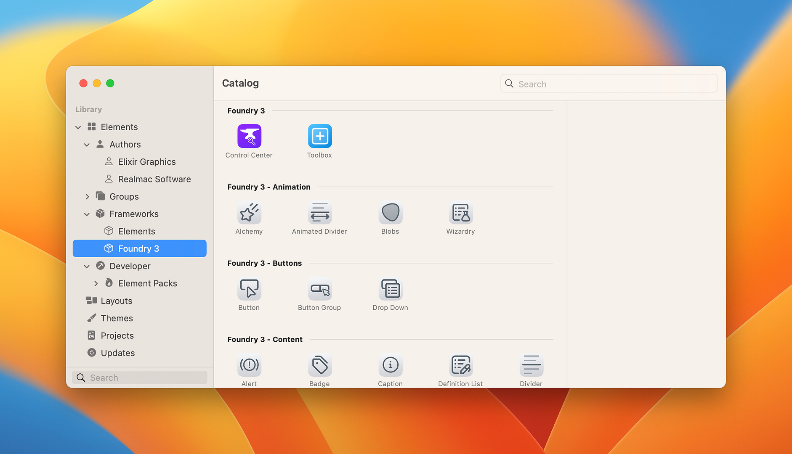

# Framework Key

If you’re porting a stacks Framework to Elements you’ll want to add the following key to your info.plist so it shows correctly in the new Elements Catalogue and Library.

<figure><figcaption><p>Catlog view in Elements Developer beta 12</p></figcaption></figure>

In each Stack within your Framework, simply add the “framework” key along with the name of your Framework as a “String” to the info.plist. Stacks will ignore this key, but Elements will use it when porting your stack over into an Element.

```markup
<key>framework</key>
<string>Foundry 3</string>
```

<figure><figcaption><p>Example of adding the Framework key to a Stack</p></figcaption></figure>
