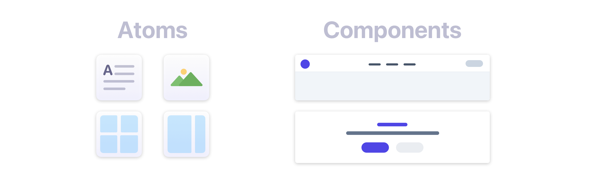
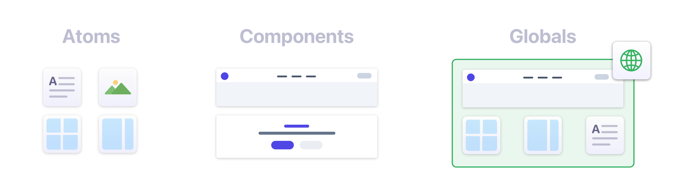

# Design System

If you're just starting out with Elements it's important to take the time to learn the difference between Atoms, Components, and Globals.

It's also worth noting that Elements is a Mobile first design system, you can learn more about all of this and more below. If you have more questions, please [visit the forum](https://forums.realmacsoftware.com).

### Atoms

Atoms represent the most basic elements of a webpage, they are at the foundation of your page design. They include things like, containers, grids, headings, text, and buttons. They are singular items, like lego bricks.

### Components

Components are generally pre-built sections, each with their own unique set of features. They include things like, navigation, footer, layouts, and galleries. They are often fixed layouts, that offer a limited amount of customisation.

Here's a high level illustration on how Atoms and Components differ.

<figure><figcaption>
Atoms and Components in Elements
</figcaption></figure>

### Globals

Globals are user created groups of atoms and/or components. Globals can help maintain a consistent design language across your entire site.

You can reuse global blocks across your site so you need only need update the content in one place and have it automagically mirrored to all other instances of that global. For example, this can be very useful for header and footer sections.

You can take Globals even further by overriding content and design aspects on an individual instance. For example you might have a banner that you want to use on every page of your site and you'd like the design to be consistent. You can use the override feature to customise the text and background image on each instance. You can even override the design settings on individual instances.

Here's a visual illustration of how Atoms and Components can be group togther to form a Global.

<figure><figcaption>
Atoms, Components, and Globals in Elements
</figcaption></figure>

### Mobile First Design

Elements is a mobile first, static website builder. Mobile has now surpassed desktop in global internet usage, Google has switched to Mobile First indexing. that’s why Elements takes a mobile first approach to website design to ensure your sites work better and rank higher in search results.

We recommend designing at the mobile breakpoint first, and working your way up through the breakpoints to support larger screens.

### Built on Tailwind and AlpineJS

Elements is built upon the popular [Tailwind CSS framework](https://tailwindcss.com/) (and AlpineJS) which makes it a piece of cake to build modern responsive websites.

By standardising on the framework used inside of Elements, we ensure third-party components work great with every website you build.&#x20;

**Elements builds a custom version of Tailwind CSS in real-time.** As you add, remove, or modify any components and content in your project, Elements generates the required CSS, and only the required CSS. Elements **does not** load Tailwind from a CDN. Doing so would have severely limited what we are able to do from a design and theming perspective.

To reiterate, **all CSS generation happens in real-time** as you edit your project. It’s truly amazing once you start working with it.

This setup ensures that Elements produces the **smallest amount of CSS possible**, as it only generates the CSS you are _actually using_ in your project.

The way Elements generates CSS for you means there is no need for each developer to write and ship the same CSS over and over again. Elements offers you a modern, reliable, flexible design system that both developers and end users can utilize.

The design system in Elements allows the app, third-party developers, and end users to all create code, components, and content separately but still maintain consistency from a design/theming perspective.

#### Learn More About Tailwind

* [Tailwind CSS](https://tailwindcss.com)
* [Tailwind CSS: Utility-First Fundamentals](https://tailwindcss.com/docs/utility-first)
* [Tailwind UI](https://tailwindui.com)
* [Why Tailwind is the Future of CSS Frameworks: A Comparison with Bootstrap](https://b-benjithomas.medium.com/why-tailwind-is-the-future-of-css-frameworks-a-comparison-with-bootstrap-aabe9a9c2166)
* [Why Is TailWind CSS So Great?](https://medium.com/codex/why-is-tailwind-css-so-great-20c407108ae1)

\
