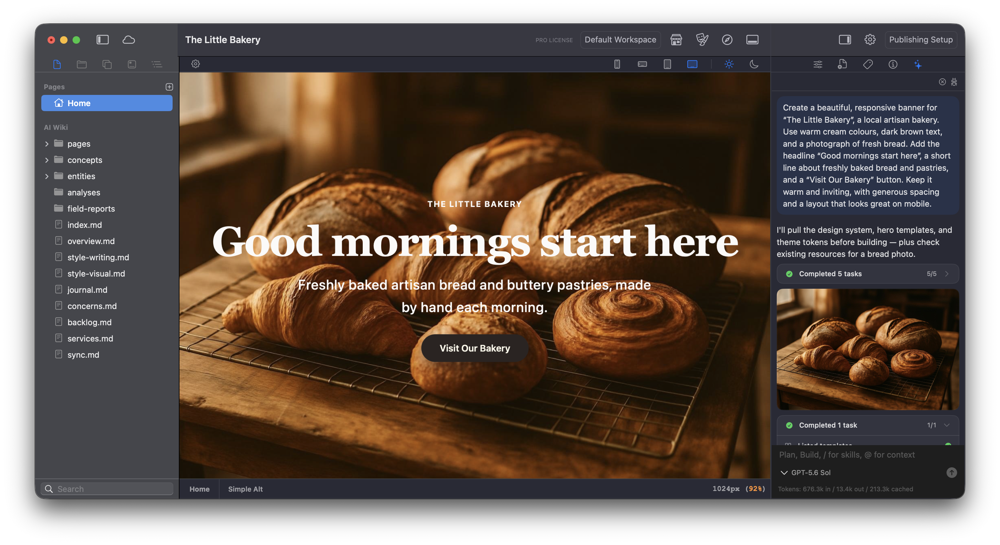

# Elements AI

Elements supports two ways to work with AI: use the **Elements AI Assistant** inside the app with your own API key, or connect an external AI tool through the **Elements MCP Server**. **AI Memory** gives AI a place to record and read context about your project. Earlier versions of Elements called this the AI Wiki.


**AI features in Elements are entirely optional.** You remain in full control of when and how it’s used.

If you prefer to work without AI, you can simply hide the AI Panel and continue building as usual.


## What each option can do

Both options work on the project you have open in Elements, and both can do most of the same things. The table shows what is available with each one today.

| What you can do | AI Assistant | MCP client |
| --- | --- | --- |
| Inspect the project's pages, components, Theme, design system, and Resources | Yes | Yes |
| Build and edit pages | Yes | Yes |
| Create and refine custom components | Yes | Yes |
| Work with CMS content | Yes | Yes |
| Add and use Resources | Yes | Yes |
| Look up the Elements documentation | Yes | Yes |
| Publish the site | Yes | Yes |
| Read and update AI Memory | Yes | Yes |
| Chat inside Elements | Yes | — |
| Drop pages, components, templates, and files onto a message | Yes | — |
| Choose a model and reasoning effort in Elements | Yes | Use the client’s controls |
| Generate images | Yes | — |
| Rewrite the copy on a page in one pass, then accept or undo it | Yes | — |
| Read a web page you link to | Yes | — |
| Break a large research or planning job into helper tasks | Yes | — |
| Show a live task list in the conversation | Yes | — |
| Open, create, close, or switch projects | — | Yes |
| Use the AI client you already subscribe to | — | Yes |
| Combine your project with files and tools outside Elements | — | Yes |

A few points worth knowing:

* **AI Memory is shared.** Whichever option you use, AI reads and writes the same project memory when it is enabled.
* **Image generation is only in the Assistant**, and it needs an OpenAI API key added to Elements.
* **Pointing at something precisely** by dragging a page, component, template, or file onto a message is an Assistant feature. In an MCP client you describe what you want changed, or use that client's own way of attaching files.
* **Your AI client may add its own abilities.** The table describes what Elements provides, so a client such as Cursor or Claude Desktop may still offer its own web browsing, planning, or task list.

## Elements AI Assistant: use your own API key

The built-in Elements AI Assistant lets you chat about your project and edit pages directly in Elements using your own provider account.

Add your keys in **Settings > AI > API Keys** in the Elements Preferences:

* **OpenAI** supports chat and image generation.
* **Anthropic (Claude)** supports chat.

You can add a key for either provider, or add both. Image generation requires an OpenAI API key. Keys are stored in the macOS Keychain, and requests go directly to your chosen provider, with usage billed to your account.

### Where to find the AI Assistant

Once you have added an API key:

1. Open your project in Elements.
2. Click the **sparkles icon** in the tabs at the top of the right-hand inspector sidebar.
3. The **AI Assistant** opens in that sidebar. Enter your request in the message field at the bottom of the panel.

The model menu only shows models from providers whose API key you have added. Use the effort menu beside it to choose how much reasoning the model should apply. **Medium** is the default; lower settings suit quick, simple changes, while higher settings can help with more complex work but may take longer and use more tokens.

For example, you could ask it to create a banner for your business, refine the text on a page, or adjust a layout.

<figure><figcaption>
The AI Assistant is in the right-hand sidebar. AI Memory appears below Pages in the left-hand sidebar; this development screenshot uses its earlier name, AI Wiki.
</figcaption></figure>

See [Elements AI Assistant](elements-ai-assistant.md) for the full API key setup instructions.

## Elements MCP Server: connect an external AI tool

The Elements MCP Server lets compatible AI tools, such as **Cursor**, **Codex**, and **Claude Desktop**, work with the project you have open in Elements.

Open **Settings > AI > MCP Server** and turn on **Allow AI tools to interact with Elements**. Copy the connection URL into your AI client's MCP settings, or use **Install in Claude Desktop…** to install the bundled Claude Desktop extension.

Keep Elements running with your project open while using the connected client. See [Elements MCP Server](elements-mcp-server.md) for connection instructions and troubleshooting.

## Control AI for each project

Click the **AI** sparkles button in the document toolbar to open **AI Options** to control how AI works with the current project. These settings are saved with that project and are enabled by default.

* **AI Memory** lets the Assistant and connected MCP clients read, search, and update the project’s memory. Turn it off when you want AI to work only from the current project state and the context you provide in the conversation.
* **Prefer Templates** tells the built-in Assistant to start with Smart Templates when it builds a new section or page. Turn it off when you want the Assistant to compose from core components. You can still name, attach, or explicitly request a template. This setting applies to new chats.

## AI Memory: context about your project

**AI Memory**, called the AI Wiki in earlier versions of Elements, appears below **Pages** in the left-hand sidebar. It keeps project-specific information such as the site’s purpose, page structure, writing style, visual direction, decisions, and plans.

**AI Memory is read-only for humans.** You can browse and read its entries in Elements, but you cannot edit them directly. When AI Memory is enabled, the Assistant and connected MCP clients can write and update entries, then use them as context when working on your project.

There is one memory store per project. The built-in Assistant and a connected AI client use the same entries, so context recorded through one option is available to the other.

For example, AI can record your preferred tone of voice or a design decision and refer to it when making later changes. If you want to add or correct information, ask the AI to update the relevant entry.

## See Elements AI in action

These videos were recorded with in-development versions of Elements. They give you an idea of what's possible, but some features, settings, and workflows may look different in the version you're using.

The videos are listed oldest first by publication date.

1. **[Elements AI can redesign your website in a single prompt](https://youtu.be/-ka3Aj2Za0w)** — 23 June 2026

   See how a single prompt can change the look of an existing website.

2. **[Elements AI can now build blogs](https://youtu.be/4FFZ5X8qLME)** — 30 June 2026

   A look at using Elements AI to fix Markdown issues and build a blog.

3. **[Elements AI Makes Tables Effortless](https://youtu.be/iplTPFAu_zc)** — 21 July 2026

   See how Elements AI can help you present data in a table on your website.

4. **[Elements AI Dev Diary: Context aware image generation](https://youtu.be/5RkD4gD8IRs)** — 23 July 2026

   An early look at generating images with awareness of your project's context.

5. **[Elements AI: From Sketch to Website](https://youtu.be/bqwVZ7xUBLE)** — 29 July 2026

   Watch a sketch become a working website with the help of Elements AI.

6. **[Building a webpage with Elements AI](https://youtu.be/APC7JV6HvDw)** — 30 July 2026

   A relaxed demonstration of trying different prompts with the AI Assistant to build a webpage.
