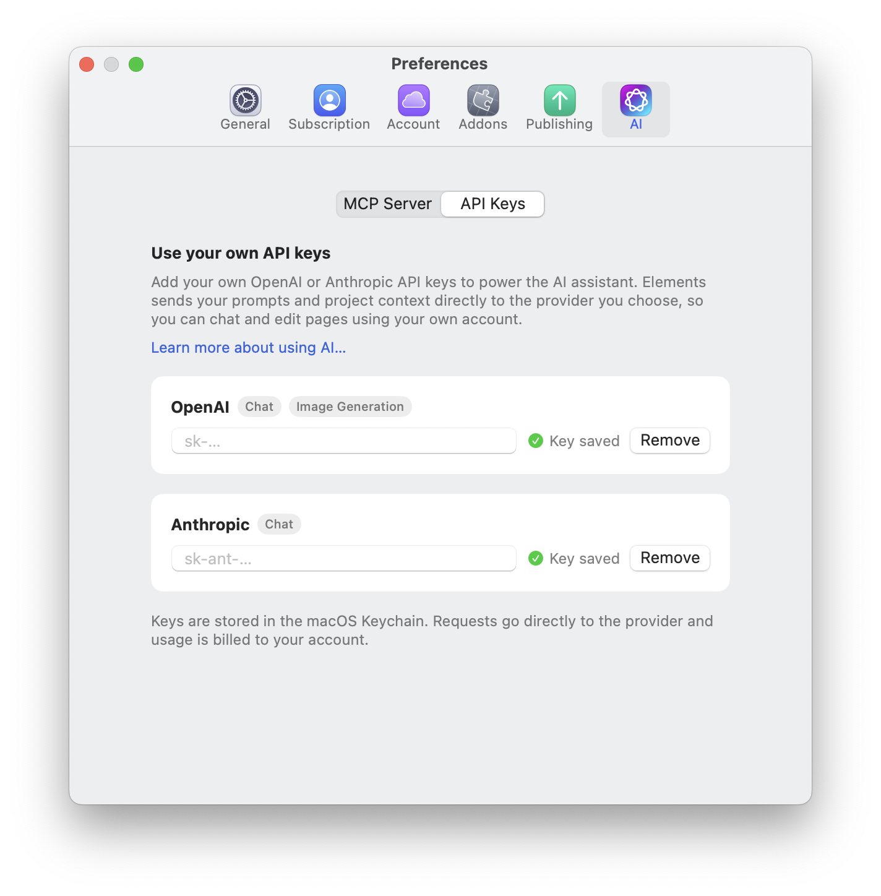
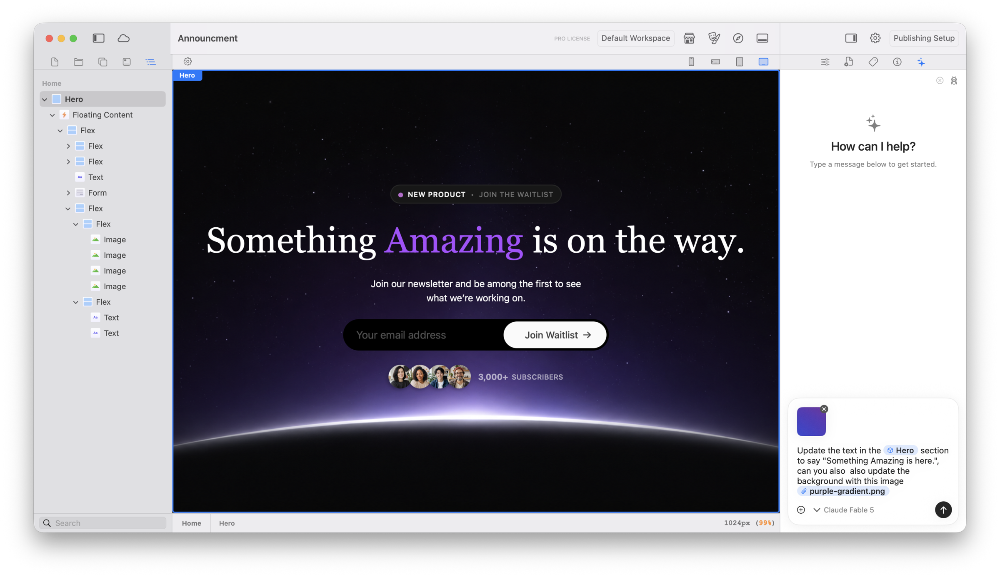
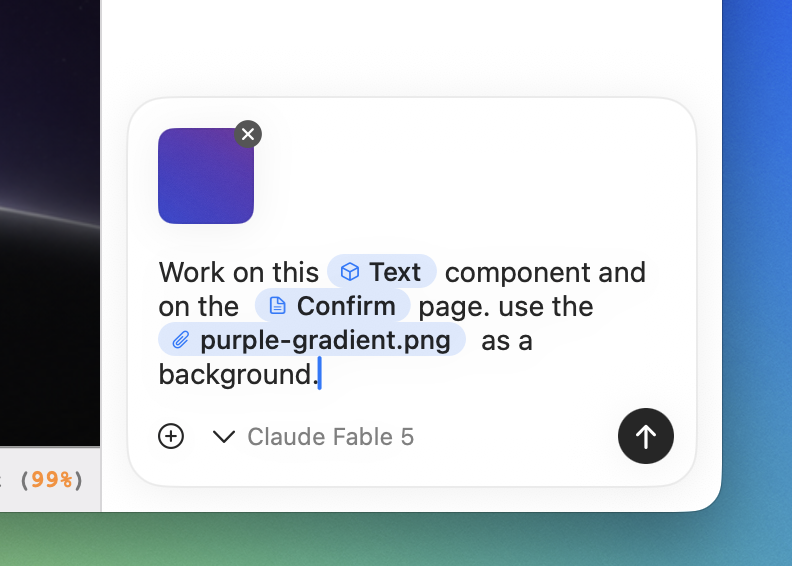
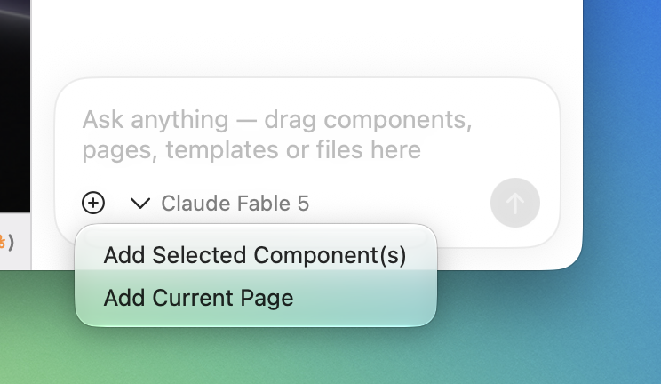

# Elements AI Assistant

The Elements AI Assistant works inside Elements and can make changes directly to your open project. Use it to build and refine pages, write content, generate images, create custom components, and work through larger tasks with an understanding of your project's existing design and content.

You remain in control of the process. Describe the result you want, inspect the changes in Elements, and continue the conversation to refine the result.

## Before you start

The Assistant uses your own OpenAI or Anthropic API account. Add a key for the provider you want to use before opening the Assistant.

| Provider | Features |
| --- | --- |
| OpenAI | Chat and image generation |
| Anthropic (Claude) | Chat |

You can add a key for either provider, or add both. Image generation requires an OpenAI API key.

### Add an API key

1. In Elements, open **Settings** to show the Preferences window.
2. Select **AI**, then **API Keys**.
3. Paste your key into the **OpenAI** or **Anthropic** field.
4. Check that **Key saved** appears beside the field.

The full settings path is **Settings > AI > API Keys**.

<figure> API Keys, with OpenAI supporting Chat and Image Generation and Anthropic supporting Chat"><figcaption>
Add your OpenAI or Anthropic API key in Settings > AI > API Keys.
</figcaption></figure>

Your keys are stored in the macOS Keychain. Elements sends your prompts and relevant project context directly to the provider you choose, and usage is billed to your account with that provider.

To remove a saved key, click **Remove** next to the provider.

## Open the AI Assistant

Once you have added an API key:

1. Open the project you want to work on.
2. Click the **sparkles icon** in the tabs at the top of the right-hand inspector sidebar.
3. Choose an available model from the menu at the bottom of the panel.
4. Enter your request and send it to begin.

<figure><figcaption>
The AI Assistant is in the right-hand sidebar. The AI Wiki appears below Pages in the left-hand sidebar.
</figcaption></figure>

If the Assistant is missing from a custom workspace, right-click the panel icons to find and open it. You can also restore the default workspace.

## What the AI Assistant can do

### Build and edit pages

Ask the Assistant to create a new section, change a layout, add components, or refine an existing page. It can work with the components, Theme settings, Resources, and structure already in your project.

For example:

> Add a three-column services section below the introduction. Use the existing card style and stack the cards on mobile.

### Write and refine content

The Assistant can draft new page content or improve existing text. Tell it what the page is for, who it is aimed at, and the tone you want.

> Rewrite the introduction for people opening their first online shop. Keep it friendly and under 80 words.

### Generate images

With an OpenAI API key, the Assistant can generate images for your project. Describe the subject, composition, style, and intended placement. Project context can help it create an image that fits the surrounding page.

> Create a warm, editorial photograph for this bakery hero. Leave clear space in the centre for the headline.

### Create and refine custom components

Ask the Assistant to build a custom component when the standard components do not provide the behaviour you need. It can create the component code and add native Inspector controls for settings you may want to adjust later.

You can continue the conversation to fix a problem, change the design, or add another control. Test generated components at each breakpoint and check any interactive behaviour before publishing.

### Plan and complete larger tasks

For a request involving several steps, the Assistant can make a plan, work through the tasks, and show its progress in the conversation. Give it a clear outcome and any constraints before it starts.

> Rework this landing page for a photography workshop. Keep the existing header and footer, reuse the current colours, and make sure the page works well on mobile.

### Use and maintain the AI Wiki

The AI Wiki stores project-specific context such as the site's purpose, page structure, terminology, writing style, visual direction, decisions, and future work.

The wiki is read-only for humans: you can browse its files in the left sidebar, but you cannot edit them directly. The Assistant can read the wiki for context and write or update entries as it learns about the project.

Ask the Assistant to record useful information or correct an existing entry:

> Add our writing guidelines to the AI Wiki: use British English, short headings, and a calm, practical tone.

Keeping this information in the wiki helps future conversations start with the same project context.

## Add context and use skills

Give the Assistant a precise target by adding project items to your message. You can drag and drop:

* A **page** from the Pages sidebar.
* A **component** from the canvas.
* An **image** from your project resources.

<figure><figcaption>
Target a component and attach an image while you continue working in the editor.
</figcaption></figure>

Each item appears as a named chip in the message. You can add several items and then describe how they should be used together. For example, you could target a Text component on a particular page and provide an image to use as its background.

<figure><figcaption>
Drag pages, components, and images into the message to give the Assistant specific targets and context.
</figcaption></figure>

To remove an item before sending, click the **×** on its preview or context chip. Adding an item to the message does not move or remove it from your project.

### Add the current selection

The **+** menu in the message field provides another quick way to add context:

* Choose **Add Selected Component(s)** to target the components currently selected on the canvas.
* Choose **Add Current Page** to target the page currently open in the editor.

<figure><figcaption>
Use the + menu to add the selected components or current page.
</figcaption></figure>

You can also use `@` in the message field to add specific project context. Use `/` to browse available skills for specialised tasks. The options shown depend on the current project and version of Elements.

Focused context helps the Assistant understand exactly which part of the project you mean and reduces the need to describe it in words.

## Get better results

* **Describe the outcome.** Explain what you want the visitor to see or do.
* **Name the location.** Identify the page, section, or component to work on.
* **Include constraints.** Mention content that must remain, brand choices to reuse, and responsive requirements.
* **Work in stages.** For a large change, start with the structure, review it, and then refine the copy and styling.
* **Give precise feedback.** Point to the specific result that needs changing and explain what should be different.
* **Check the result.** Inspect the editor and browser preview at each relevant breakpoint before publishing.

## AI Assistant and MCP

The built-in Assistant is the simplest way to work with AI inside Elements. If you prefer to use an external AI client such as Claude Desktop, Codex, Cursor, or LM Studio, connect it through the [Elements MCP Server](elements-mcp-server.md).

Both approaches work with the project open in Elements, but their setup is separate: the Assistant uses **Settings > AI > API Keys**, while external clients connect through **Settings > AI > MCP Server**.

### Comparing costs

Using your own API key can be more expensive than connecting through MCP when your AI client already includes model usage in a paid subscription. API usage is metered and billed separately by OpenAI or Anthropic, even if you also pay for ChatGPT or Claude.

Many AI subscriptions bundle substantial usage into a fixed monthly price. Using that subscribed client through Elements MCP can therefore be more economical for regular or intensive work. Plan limits still apply, and the cheaper option depends on the model, the amount of work, and the terms of your subscription. For occasional use, direct API billing may cost less.

Check your provider’s current plan limits and API pricing before choosing.
