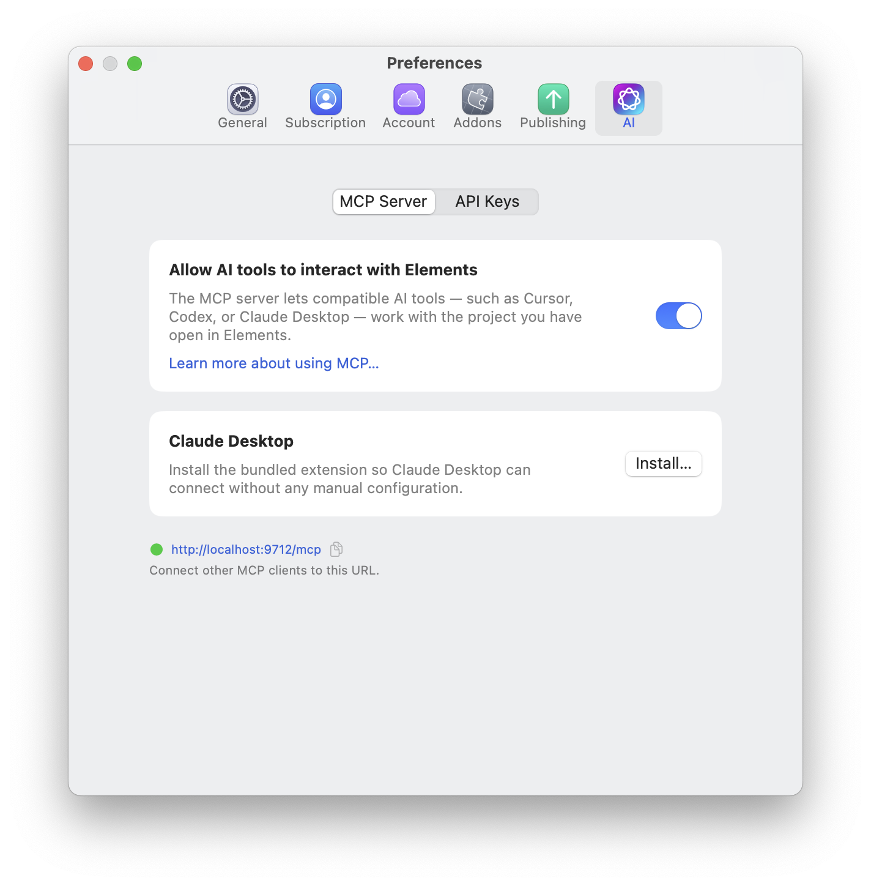

# Elements MCP Server

The built-in Elements MCP (Model Context Protocol) server lets compatible AI tools work with the project you have open in Elements. You can connect clients such as **Cursor**, **Codex**, or **Claude Desktop**.

Keep Elements running with your project open while using a connected AI tool.

## What MCP adds

The MCP server acts as a bridge between Elements and your AI client. Elements provides the client with tools for understanding and changing the open project, while the client supplies the AI model and conversation.

You do not need to add an OpenAI or Anthropic API key to Elements when you work through MCP. Sign in to your chosen AI client or configure its model provider, then connect that client to the MCP server.

Through a compatible client, you can:

* Inspect a project's pages, components, resources, Theme, and design system before making changes.
* Create, edit, duplicate, move, and organise pages and components.
* Build and refine custom components.
* Add resources and work with CMS content.
* Read AI Memory for project context and update it with useful decisions and notes when memory is enabled.
* Look up the Elements documentation.
* Review a project for inconsistent content, layout, styling, or structure.
* Open, create, close, or switch projects, which the built-in Assistant cannot do.
* Publish the site.

Image generation is the main thing MCP cannot do. It needs an OpenAI API key added to Elements and is only available in the built-in Assistant.

The exact experience depends on the AI client and model you use. The client decides how it plans a task, which Elements tools it calls, and what other files or services it can work with.

For a side-by-side list of what each option can do, see [What each option can do](README.md#what-each-option-can-do).

## Ways to use MCP

MCP works well for focused page edits and for larger jobs that involve several parts of a project. For example:

> Review the Home and About pages, then make their headings, spacing, and calls to action consistent with the existing design system.

> Build a reusable testimonial component with Inspector controls for the quote, name, role, portrait, and alignment. Add it below the services section.

> Read the project brief from AI Memory, inspect the current pages, and create a Contact page that matches the rest of the site.

An external client may also be able to combine Elements with context outside the project, such as a brief, a folder of images, source code, or another connected service. What is available depends on that client's features and permissions.

## Why choose MCP over the AI Assistant?

The built-in [Elements AI Assistant](elements-ai-assistant.md) is the quickest option when you want to stay inside Elements. It supports direct chat, drag-and-drop targeting, one-pass copy rewrites, and image generation with an OpenAI API key. Requests made with your own OpenAI or Anthropic key are metered and billed separately by that provider.

In an MCP client there is nothing to drag onto a message, so describe the page or component you mean, or use that client's own way of attaching files.

MCP is often a better fit when you:

* Already use a compatible AI client and prefer its models, conversation history, instructions, or skills.
* Want the AI to work with both your Elements project and files or tools outside Elements.
* Need help with a larger task that benefits from planning and several coordinated steps.
* Have an AI subscription that includes usage and would rather use that allowance than pay separate API charges.

Many paid AI subscriptions include a substantial amount of usage for a fixed monthly price. For regular or intensive work, using that subscribed client through MCP can therefore cost less than using a separately billed API key in Elements. MCP itself does not include an AI subscription, and the cheaper option depends on your client's plan limits, the model, and how much you use it. Occasional API use may still cost less.

## Enable the MCP server

1. In Elements, open **Settings** to show the Preferences window.
2. Select **AI**, then **MCP Server**.
3. Turn on **Allow AI tools to interact with Elements**.
4. Use the copy button beside the connection URL to copy it for your AI client.

The full settings path is **Settings > AI > MCP Server**. The screenshot below shows the server enabled, with a green status indicator and the URL `http://localhost:9712/mcp`.

<figure> MCP Server, the enabled Allow AI tools to interact with Elements switch, the connection URL, and the Install in Claude Desktop button"><figcaption><p>Enable the MCP server and connect your AI client in Settings > AI > MCP Server.</p></figcaption></figure>

## AI options that affect MCP

Click the **AI** sparkles button in the document toolbar to open **AI Options** to control whether MCP clients can use **AI Memory** for the current project. AI Memory is enabled by default. Turning it off can make MCP work faster because the client skips memory lookup and maintenance, but it will not read or update that context for future conversations. Connected clients can still inspect and edit the live project through the other Elements tools.

The **Prefer Templates** option controls the built-in AI Assistant. An external AI client decides when to list or apply Elements templates through MCP, so give it an explicit instruction when you want a template-based section or page.

## Connect Claude Desktop

Elements includes a bundled extension so Claude Desktop can connect without manual configuration.

1. Enable the MCP server using the steps above.
2. In the **Claude Desktop** section, click **Install in Claude Desktop…**.
3. Follow the installation prompts in Claude Desktop.
4. Keep your Elements project open, then use Claude Desktop to work with it.

## Use ChatGPT in Work mode

ChatGPT must be in **Work mode** to use the Elements MCP server. A regular Chat conversation cannot attach directly to an arbitrary local MCP address such as `localhost:9712/mcp`.

If ChatGPT says that the current chat session does not have a connector that can attach to the local endpoint, the conversation is running in the wrong mode. Switch that conversation to **Work mode**, or start a new Work task, then ask it to connect to Elements again. Keep Elements running, leave the project open, and make sure **Allow AI tools to interact with Elements** is enabled.

This message does not mean the Elements MCP server is broken; it means the current ChatGPT conversation cannot access local MCP connections. See the [Getting started with Codex and the MCP server in Elements](https://forums.realmacsoftware.com/t/getting-started-with-codex-and-the-mcp-server-in-elements-cms/56369) forum guide for another walkthrough.

## Connect Codex, Cursor, or another MCP client

Copy the URL shown in **Settings > AI > MCP Server** and add it to your AI client's MCP server settings. Use the URL displayed in Elements, as the port may differ from the example below:

```text
http://localhost:9712/mcp
```

This is a local connection to Elements on your Mac. Your client needs to support connecting to a local HTTP MCP server. The exact setup steps depend on the client you use.

### LM Studio configuration example

For LM Studio, add an MCP server configuration like this. Replace the URL if Elements shows a different one.

```json
{
  "mcpServers": {
    "elements": {
      "url": "http://localhost:9712/mcp"
    }
  }
}
```

## Troubleshooting

If your AI client cannot connect or loses its connection:

* Check that Elements is running and a project is open.
* Check that **Allow AI tools to interact with Elements** is switched on.
* Check that the URL in your client matches the URL currently shown in Elements.
* Reconnect or restart the MCP connection in your AI client.
* If you are using ChatGPT, check that the conversation is in **Work mode**. MCP connections are unavailable in a regular Chat conversation.

## Turn off the MCP server

Open **Settings > AI > MCP Server** and turn off **Allow AI tools to interact with Elements** to stop AI clients interacting with Elements through the server.

For help adding API keys to the built-in assistant, see [Elements AI Assistant](elements-ai-assistant.md).
